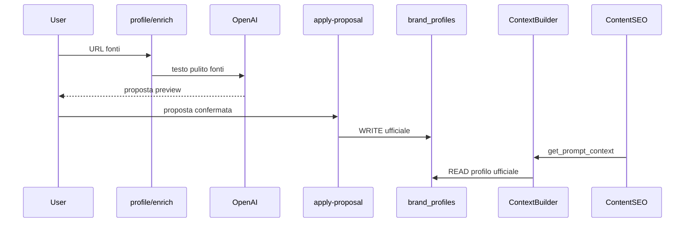

# Architettura AI

## Regola obbligatoria: Brand Intelligence Context

Ogni modulo AI che genera contenuti rivolti al brand **deve** caricare il contesto brand prima di produrre output.

```python
from app.services.brand_intelligence.context import BrandIntelligenceContextBuilder

bundle = await BrandIntelligenceContextBuilder.build_brand_context(session, project_id)
prompt_block = BrandIntelligenceContextBuilder.format_for_prompt(bundle)
# bundle.primary_source == "brand_profile" se profilo ufficiale sufficiente
```

**Priorità context (0.3.2 machine-ready):**

1. `brand_profiles` ufficiale → `primarySource=brand_profile` se profilo minimo presente
2. Profilo incompleto → `primarySource=minimal`, `missingContext` unificato (profile + identity + visual)
3. Bundle include `brandContextVersion: v1` e `promptContext` con blocchi testuali separati
4. `brand_identities` e `brand_visual_identities` aggiunti al bundle e al prompt se compilati

Moduli futuri (PED, Ads, Email) partono dal **Brand Profile** come contesto minimo; Identity e Visual arricchiscono il prompt.

Content SEO e Product SEO usano `get_prompt_context()` — beneficiano automaticamente dei tre moduli ufficiali.

### promptContext (v0.3.2)

`GET /brand-intelligence/context` restituisce sempre `promptContext` quando il profilo è sufficiente:

```json
{
  "brandContextVersion": "v1",
  "promptContext": {
    "brandProfile": "BRAND PROFILE\n- Nome: ...",
    "brandIdentity": "BRAND IDENTITY\n- Posizionamento: ...",
    "visualIdentity": "VISUAL IDENTITY\n- Colori: ...",
    "fullText": "..."
  }
}
```

**Regola:** i moduli AI non devono usare campi UI raw nei prompt — solo `BrandContextBuilder` / `get_prompt_context()`.

Esempi di blocchi richiesti per modulo (futuro):

| Modulo | Blocchi consigliati |
|--------|---------------------|
| Product SEO | profile + identity + product knowledge + safe claims |
| PED | profile + identity + visual + social guidelines + pillars |
| Ads | profile + identity + safe claims + ads guidelines |
| Email | profile + identity + product knowledge + audience |

## Popolamento Brand Intelligence (v0.3.2)

| Percorso | Salvataggio |
|----------|-------------|
| **Brand Profile enrich** | Proposta in memoria; metadata fonti su profilo |
| **Apply proposal (profile)** | Campi contenuto ufficiali su `brand_profiles` |
| **Identity import-file** | Proposta AI da 1 file in memoria (no save) |
| **Apply proposal (identity)** | Scrittura ufficiale su `brand_identities` |
| **PUT identity** | Scrittura manuale su `brand_identities` |
| **Visual extract** | Proposta palette/logo/font in memoria |
| **Apply proposal (visual)** | Scrittura ufficiale su `brand_visual_identities` |
| **Salvataggio manuale** | Via `PUT` su ciascun modulo |

### Flussi deprecati (non in UI)

- Brand Intelligence Brief, Import AI, section drafts, extracted facts
- Tabelle legacy restano in DB; non alimentano il ContextBuilder v1



### Source enrichment

File: `source_fetcher.py`, `profile_enrichment.py`

- Fetch parallelo leggero (website, social OG, recensioni)
- 403/429 → status `blocked`, warning, nessun fallimento globale
- Prompt italiano: non inventare, no claim medici, no SEO/ads in questo step
- Nessun auto-save sui campi contenuto
