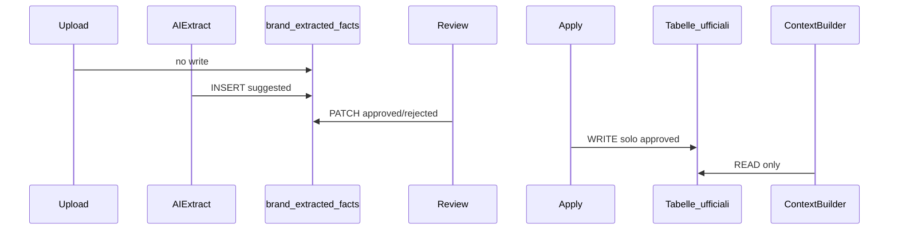
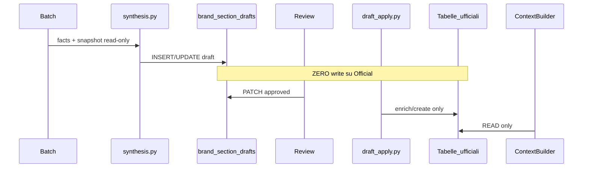

# Architettura AI

## Regola obbligatoria: Brand Intelligence Context

Ogni modulo AI che genera contenuti rivolti al brand **deve** caricare il contesto brand prima di produrre output.

```python
from app.services.brand_intelligence.context import BrandIntelligenceContextBuilder

bundle = await BrandIntelligenceContextBuilder.build_brand_context(session, project_id)
prompt_block = BrandIntelligenceContextBuilder.format_for_prompt(bundle)
```

Se `prompt_block` è `None`, il modulo decide se bloccare (futuro) o procedere con fallback (SEO v1).

**Nessun modulo AI brand-facing deve generare contenuti ignorando Brand Intelligence.**

## Popolamento Brand Intelligence

Due percorsi equivalenti per i dati ufficiali:

| Percorso | Salvataggio |
|----------|-------------|
| Wizard / tab CRUD | Diretto su tabelle ufficiali |
| AI File Import (facts) | Facts `suggested` → review → `approved` → `apply` |
| AI Section Synthesis (0.2.3) | Bozze `draft` → review → `approved` → `apply` (enrich non distruttivo) |

Il ContextBuilder legge **solo** tabelle ufficiali. Sono esclusi dal contesto AI:

- Facts in `brand_extracted_facts` non approvati
- Bozze in `brand_section_drafts` non applicate (`draft`, `needs_review`, `approved`, `rejected`)



### Section synthesis (0.2.3)

File: `synthesis.py`, `draft_apply.py`, `section_drafts_service.py`

- Dopo conflict detection nel batch: sintesi OpenAI per 9 sezioni → `brand_section_drafts`
- Progress batch 80–95% con step per sezione
- Apply enrich: nessun overwrite su campi ufficiali già valorizzati; conflitti → `needs_review`
- Facts restano evidenze; la review principale è per bozza sezione



## Moduli e integrazione

### SEO Proposal Engine (implementato)

File: `apps/api/app/services/content/seo_proposal_engine.py`, `seo_proposal_field_engine.py`

- Prima della chiamata OpenAI: `get_prompt_context(session, project_id)`
- Se presente, append `# Brand Intelligence` al system prompt
- Fallback se profilo assente o score &lt; 10

### AI Document Import (implementato v1 + batch jobs v0.2.2)

File: `batch_service.py`, `batch_processor.py`, `conflict_detection.py`, `document_extraction.py`, `fact_apply.py`, `text_extraction.py`

- Upload crea `BrandImportBatch` persistente; start job async con `asyncio.create_task`
- Progress tracking su DB; frontend polling ogni 2s
- Conflict detection read-only vs tabelle ufficiali (`update_mode`, `previous_value`, `conflict_status`)
- Upload + estrazione testo senza OpenAI
- Estrazione AI richiede `OPENAI_API_KEY`
- Output structured JSON: `document_type`, `facts[]`, `warnings[]`
- Regole: no invenzioni, confidence cap su deduzioni, `unknown` se incerto
- Apply mappa facts approvati su entità CRUD esistenti; rispetta `update_mode` (no overwrite automatico)

### PED / Product Editorial (futuro)

Obbligatorio: voice, products, claims, guardrails. Blocco generazione se score &lt; 60.

### Ads Copy Generator (futuro)

Obbligatorio: profile, audience, claims. Validazione claim `forbidden` post-generazione.

### Email / Klaviyo (futuro)

Obbligatorio: voice, audience, content pillars. Tone check su output.

## Score come gate

| Score | Comportamento SEO v1 | Comportamento moduli futuri |
|-------|---------------------|----------------------------|
| 0–9 | Fallback (no brand block) | Blocco o warning |
| 10–59 | Brand block in prompt | Warning + lacune esplicite |
| 60+ | Brand block completo | Generazione consentita |
| 80+ | Ottimale | Generazione premium |

## Estensioni pianificate

- Site scan e social per arricchimento automatico
- OCR immagini/PDF scansionati
- Validazione output AI contro `BrandClaimRule` e `BrandAiGuardrail`
