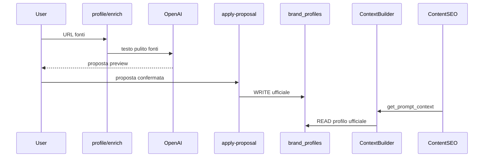

# Architettura AI

## Regola obbligatoria: Brand Intelligence Context

Ogni modulo AI che genera contenuti rivolti al brand **deve** caricare il contesto brand prima di produrre output.

```python
from app.services.brand_intelligence.context import BrandIntelligenceContextBuilder

bundle = await BrandIntelligenceContextBuilder.build_brand_context(session, project_id)
prompt_block = BrandIntelligenceContextBuilder.format_for_prompt(bundle)
# bundle.primary_source == "brand_profile" se profilo ufficiale sufficiente
```

**Priorità context (0.3.0 Brand Profile v1):**

1. `brand_profiles` ufficiale (dopo apply-proposal o salvataggio manuale) → `primarySource=brand_profile`
2. Profilo incompleto → `primarySource=minimal`, `missingContext` elenca campi mancanti

Moduli futuri (PED, Ads, Email) devono partire dal **Brand Profile v1** come primo contesto. Le sezioni avanzate (voice, claims, SEO strategy, ecc.) saranno reintrodotte una alla volta quando stabili.

Content SEO e Product SEO usano `get_prompt_context()` — beneficiano automaticamente del profilo ufficiale.

Se `prompt_block` è `None`, il modulo decide se bloccare (futuro) o procedere con fallback (SEO v1).

**Nessun modulo AI brand-facing deve generare contenuti ignorando Brand Profile ufficiale.**

## Popolamento Brand Intelligence (v0.3.0)

| Percorso | Salvataggio |
|----------|-------------|
| **Brand Profile enrich** | Proposta in memoria; metadata fonti su profilo |
| **Apply proposal** | Campi contenuto ufficiali su `brand_profiles` |
| **Salvataggio manuale** | URL fonti e/o contenuto via `PUT .../profile` |

### Flussi deprecati (non in UI)

- Brand Intelligence Brief, Import AI, section drafts, extracted facts
- Tabelle legacy restano in DB; non alimentano il ContextBuilder v1



### Source enrichment

File: `source_fetcher.py`, `profile_enrichment.py`

- Fetch parallelo leggero (website, social OG, recensioni)
- 403/429 → status `blocked`, warning, nessun fallimento globale
- Prompt italiano: non inventare, no claim medici, no SEO/ads in questo step
- Nessun auto-save sui campi contenuto
