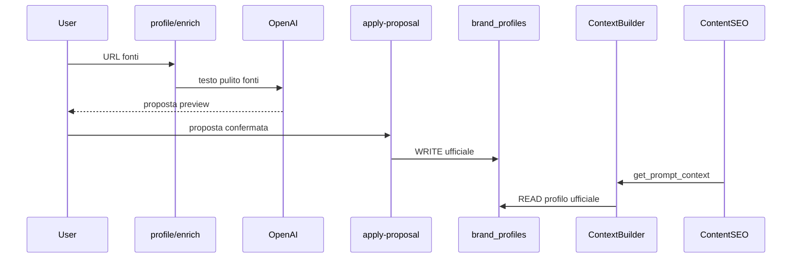

# Architettura AI

## Client centralizzato e usage logging (0.5.0-alpha)

**Regola obbligatoria:** tutte le chiamate OpenAI devono passare da `apps/api/app/services/ai/ai_client.py` tramite `generate_structured_json()`.

- **Nessun service** deve importare `AsyncOpenAI` o chiamare l'API OpenAI direttamente.
- Ogni richiesta richiede `AiRequestMetadata`: `project_id`, `module`, `operation` (+ opzionali `entity_type`, `entity_id`, `job_id`, `context_profile`, `context_hash`, `context_chars`, `context_blocks_used`).
- Ogni richiesta viene persistita in **`ai_usage_logs`** (`AiUsageLog`): token, costo stimato, durata, hash prompt (no prompt completo).
- Pricing modelli: `apps/api/app/services/ai/pricing.py` (file versionato, aggiornabile senza migration).
- Preview prompt/output solo se `AI_LOG_PROMPT_PREVIEW=true` (max 500 caratteri).

### Cost guardrails (env)

| Variabile | Effetto |
|-----------|---------|
| `AI_DAILY_BUDGET_USD` | Blocca nuove richieste se spesa giornaliera superata |
| `AI_MONTHLY_BUDGET_USD` | Blocca nuove richieste se spesa mensile superata |
| `AI_SINGLE_REQUEST_WARN_USD` | Log warning post-richiesta |
| `AI_SINGLE_REQUEST_BLOCK_USD` | Blocca richiesta se costo stimato supera soglia |

Errore budget → HTTP 429 con messaggio leggibile. UI: pagina **AI Costs** + banner in sidebar projects.

### Compact context e prompt caching

- **`build_context_for_profile()`** in `apps/api/app/services/ai/context_profiles.py` — **unica via ufficiale** per costruire contesto AI operativo (0.5.2-alpha).
- `build_ai_context_for_task()` in `context_builder.py` è uno shim deprecato verso i profili.
- `prompt_cache_key = project:{id}:ctx:{hash}:module:{module}` — prefix stabile; ordine contesto: profilo statico → blocchi brand → dati entità → schema output.

### AI Context Profiles (0.5.2-alpha)

**Regola architetturale:** nessun modulo AI deve costruire prompt con Brand Intelligence raw direttamente. Ogni modulo deve dichiarare un `AiContextProfile`.

Flusso:

```
BrandIntelligenceContextBuilder → AI Context Profiles → ai_client → AiUsageLog
```

| Profilo | Uso tipico |
|---------|------------|
| `minimal` | Task piccoli, enrichment profilo |
| `image_alt` | Alt immagini prodotto/collection |
| `product_seo_field` / `collection_seo_field` | Singolo campo SEO |
| `product_seo_full` / `collection_seo_full` | Proposta SEO completa |
| `blog_brief` | Brief editoriale |
| `article_draft` | Articolo da brief approvato |
| `brand_import` | Import/estrazione/sintesi BI |
| `compliance_review` | Revisione claim |
| `generic` | Fallback esplicito |

Ogni profilo restituisce `contextText`, `contextBlocksUsed`, `warnings`, `contextHash`. `AiRequestMetadata` e `AiUsageLog` tracciano `context_profile`, `context_hash`, `context_chars`, `context_blocks_used`.

### AI Model Routing (0.5.3-alpha)

**Regola architetturale:** nessun servizio decide il modello OpenAI. La risoluzione è centralizzata in `apps/api/app/services/ai/model_policy.py` tramite `resolve_ai_model()`.

Flusso aggiornato:

```
AI Context Profiles → resolve_ai_model → ai_client → AiUsageLog
```

| Tier | Uso tipico |
|------|------------|
| `cheap` | Alt immagini, singolo campo SEO, task minimal |
| `standard` | Proposte SEO complete, brief, import BI |
| `premium` | Articoli da brief approvato |
| `reasoning` | Compliance review (solo se `OPENAI_MODEL_REASONING` configurato) |
| `fallback` | Modello di ripiego se tier non configurato |

Env tier models: `OPENAI_MODEL_CHEAP`, `OPENAI_MODEL_STANDARD`, `OPENAI_MODEL_PREMIUM`, `OPENAI_MODEL_REASONING`, `OPENAI_MODEL_FALLBACK`. `OPENAI_MODEL` resta fallback globale.

Opzioni:

- `AI_ALLOW_MODEL_OVERRIDE=true` — consente `model=` esplicito su `generate_structured_json()`
- `AI_ENABLE_MODEL_FALLBACK_ON_SCHEMA_ERROR=true` — retry automatico su tier `standard` se JSON invalido

`AiUsageLog` traccia anche `model_tier`, `model_policy_source`, `requested_model`, `max_output_tokens`, `temperature`, `reasoning_effort`. La pagina **AI Costs** espone breakdown per tier e **Model Routing Insights**.

Vedi anche [Ottimizzazione costi AI](cost-optimization.md).

### AI Operation Registry e Model Settings (0.5.4-alpha)

**Registry:** `apps/api/app/services/ai/operation_registry.py` elenca ogni punto AI del tool (`operation_key`, tier consigliato, token, temperature, qualità, stato `implemented|planned|non_ai`).

**DB:** tabella `ai_model_settings` — override per progetto o globali (`project_id` nullable). Seed iniziale da registry + env Railway.

**Ordine risoluzione modello** in `resolve_ai_model()`:

1. Setting manuale progetto per `operation_key`
2. Setting globale per `operation_key`
3. Registry default + env tier (`OPENAI_MODEL_CHEAP/STANDARD/PREMIUM/REASONING`)
4. `OPENAI_MODEL_FALLBACK`
5. `OPENAI_MODEL` legacy
6. Errore se nessun modello disponibile

`OPENAI_MODEL` Railway **non** comanda più tutte le richieste: serve solo come fallback finale e seed iniziale. Non va rimosso, ma non sostituisce setting DB per operation. Le scelte operative vivono in **AI Costs → Model Settings**.

`AiRequestMetadata.operation_key` è obbligatorio sui call site implementati; se assente, inferenza da `module+operation+context_profile` con warning (no crash).

API: `GET/PUT/POST /api/projects/{id}/ai-model-settings`, `GET /api/ai-model-settings/available-models`.

### Moduli tracciati

`brand_intelligence`, `product_seo`, `content_seo`, `blog_brief`, `article_generator` (+ operazioni batch BI/editorial).

---

## Regola obbligatoria: Brand Intelligence Context

Ogni modulo AI che genera contenuti rivolti al brand **deve** caricare il contesto brand prima di produrre output.

```python
from app.services.brand_intelligence.context import BrandIntelligenceContextBuilder

bundle = await BrandIntelligenceContextBuilder.build_brand_context(session, project_id)
prompt_block = BrandIntelligenceContextBuilder.format_for_prompt(bundle)
# bundle.primary_source == "brand_profile" se profilo ufficiale sufficiente
```

**Priorità context (0.3.6 machine-ready):**

1. `brand_profiles` ufficiale → `primarySource=brand_profile` se profilo minimo presente
2. Profilo incompleto → `primarySource=minimal`, `missingContext` unificato
3. Bundle include `brandContextVersion: v1` e `promptContext` con blocchi testuali separati
4. Moduli ufficiali: Profile, Identity, Visual, Safe Claims, Product Knowledge, FAQ & Objections, **Editorial Guidelines**
5. Product SEO: contesto brand + lookup `productKnowledge` per `shopify_product_id`; fallback generale se item assente
6. **FAQ & Objections** (se compilata): dubbi, obiezioni e risposte consigliate in `fullText`
7. **Editorial Guidelines** (se compilate): filosofia contenuti, persone brand, regole CTA community in `fullText`
8. **Safe Claims ha priorità** su FAQ e Editorial Guidelines: non usare altre sezioni per claim non consentiti
9. **AI Context Preview** (tab UI): mostra `promptContext.previewText`

**Regola fonte unica:** `BrandIntelligenceContextBuilder` resta la fonte centrale dei dati brand. I moduli AI **non** usano `format_for_prompt()` / `fullText` raw: ricevono slice compatte tramite **AI Context Profiles** (`context_profiles.py`). Vedi [Architettura AI](ai-architecture.md#ai-context-profiles-052-alpha).

Content SEO e Product SEO usano profili dedicati (`product_seo_field`, `blog_brief`, `article_draft`, ecc.). Se FAQ & Objections è vuota, il comportamento resta invariato.

### Blog Brief Generator (implementato — Content SEO Editorial 0.4.1-alpha, aggiornato 0.4.8-alpha)

Modulo attivo nella tab **Blog & Ricette** per generare brief SEO su singolo item editoriale.

- **Input**: item editoriale (tipo, keyword, obiettivo, prodotto collegato, note)
- **Context**: `BrandIntelligenceContextBuilder` — profilo, identity, Safe Claims, FAQ, **Editorial Guidelines**, Product Knowledge (+ PK specifico prodotto se collegato)
- **Editorial Guidelines (0.4.8)**: suggerimento autore opzionale (`authorSuggestion`), profilo lunghezza, CTA community, note tono nel `brief_payload`
- **Safe Claims**: priorità assoluta nel prompt; claim vietati in `claimsToAvoid`
- **Output**: `brief_payload` JSONB; stato `brief_pending` dopo generate → `brief_approved` dopo approvazione utente
- **Prerequisito Article Generator**: solo item con `brief_approved` e brief valorizzato
- **Nessuna pubblicazione automatica** Shopify in questo step

### Blog Article Draft Generator (implementato — Content SEO Editorial 0.4.6-alpha, aggiornato 0.4.7-alpha, 0.4.8-alpha)

Modulo attivo nella tab **Articolo & Anteprima** per generare bozze articolo da brief approvato.

- **Input**: `brief_payload` approvato + metadati item (tipo, prodotto collegato)
- **Context**: `BrandIntelligenceContextBuilder` — profilo, identity, Safe Claims, FAQ, **Editorial Guidelines**, Product Knowledge (+ PK specifico prodotto se collegato)
- **Editorial Guidelines (0.4.7)**: articoli 700–1100 parole, tono umano, CTA community separata da CTA commerciale
- **Firma opzionale (0.4.8)**: `authorName`/`authorRole` solo se `authorSuggestion` nel brief approvato; post-processing sovrascrive firme inventate dall'AI
- **Safe Claims**: priorità assoluta nel prompt; nessun claim medico o terapeutico inventato
- **Output**: `article_payload` JSONB con `bodyHtml` sanitizzato, `authorName`, `communityCta`, `estimatedReadingTime`, `contentLengthProfile`
- **Anteprima**: HTML renderizzato lato client (whitelist tag via DOMParser) dopo sanitizzazione backend
- **Review umana**: salva bozza, modifica manuale, `ready_to_publish` prima di Shopify Publisher (step futuro)
- **OPENAI_API_KEY** richiesta; BI incompleta → warnings, non blocco

### Product SEO e Product Knowledge

Per ogni prodotto Shopify in ottimizzazione SEO:

1. Carica contesto brand (`profile` + `identity` + `safeClaims` + knowledge generale)
2. Se esiste `BrandProductKnowledgeItem` per quel `shopify_product_id` → include blocco specifico
3. Se item assente → usa solo knowledge generale + dati Shopify
4. Se Product Knowledge vuota → comportamento invariato (solo brand context + Shopify)

### promptContext (v0.3.6)

`GET /brand-intelligence/context` restituisce sempre `promptContext` quando il profilo è sufficiente.

```json
{
  "brandContextVersion": "v1",
  "faqObjections": { "generalFaq": [], "objections": [] },
  "promptContext": {
    "brandProfile": "BRAND PROFILE\n- Nome: ...",
    "brandIdentity": "BRAND IDENTITY\n- Posizionamento: ...",
    "visualIdentity": "VISUAL IDENTITY\n- Colori: ...",
    "safeClaims": "SAFE CLAIMS & RED FLAGS\n- ...",
    "productKnowledge": "PRODUCT KNOWLEDGE — GENERAL\n- ...",
    "faqObjections": "FAQ & OBJECTIONS\nFAQ generali:\n- ...",
    "editorialGuidelines": "EDITORIAL GUIDELINES\nFilosofia contenuti: ...",
    "fullText": "...",
    "previewText": "..."
  }
}
```

- **`fullText`**: contesto compatto per moduli AI (sezioni vuote omesse)
- **`previewText`**: anteprima human-friendly per tab AI Context
- **`faqObjections`**: blocco testuale con FAQ, obiezioni, miti e risposte consigliate (omesso se vuoto)
- **`editorialGuidelines`**: filosofia contenuti, persone brand, regole CTA community (omesso se vuoto)

**Regola:** i moduli AI non devono usare campi UI raw nei prompt — solo `BrandContextBuilder` / `get_prompt_context()`.

Esempi di blocchi richiesti per modulo (futuro):

| Modulo | Blocchi consigliati |
|--------|---------------------|
| Product SEO | profile + identity + product knowledge + safe claims |
| PED | profile + identity + visual + social guidelines + pillars |
| Ads | profile + identity + safe claims + ads guidelines |
| Email | profile + identity + product knowledge + audience |

## Popolamento Brand Intelligence (v0.3.3)

| Percorso | Salvataggio |
|----------|-------------|
| **Brand Profile enrich** | Proposta in memoria; metadata fonti su profilo |
| **Apply proposal (profile)** | Campi contenuto ufficiali su `brand_profiles` |
| **Identity import-file** | Proposta AI da 1 file in memoria (no save) |
| **Apply proposal (identity)** | Scrittura ufficiale su `brand_identities` |
| **PUT identity** | Scrittura manuale su `brand_identities` |
| **Visual extract** | Proposta palette/logo/font in memoria |
| **Apply proposal (visual)** | Scrittura ufficiale su `brand_visual_identities` |
| **Safe Claims import-file** | Proposta AI da 1 file in memoria (no save) |
| **Apply proposal (safe claims)** | Scrittura ufficiale su `brand_safe_claims` |
| **Product Knowledge general import** | Proposta AI generale da 1 file (no save, no item) |
| **Apply proposal (PK general)** | Scrittura su `brand_product_knowledge_general` |
| **Items from-shopify** | Crea scheda precompilata su `brand_product_knowledge_items` |
| **PUT item** | Salvataggio manuale scheda prodotto |
| **Salvataggio manuale** | Via `PUT` su ciascun modulo |

### Flussi deprecati (non in UI)

- Brand Intelligence Brief, Import AI, section drafts, extracted facts
- Tabelle legacy restano in DB; non alimentano il ContextBuilder v1



### Source enrichment

File: `source_fetcher.py`, `profile_enrichment.py`

- Fetch parallelo leggero (website, social OG, recensioni)
- 403/429 → status `blocked`, warning, nessun fallimento globale
- Prompt italiano: non inventare, no claim medici, no SEO/ads in questo step
- Nessun auto-save sui campi contenuto
