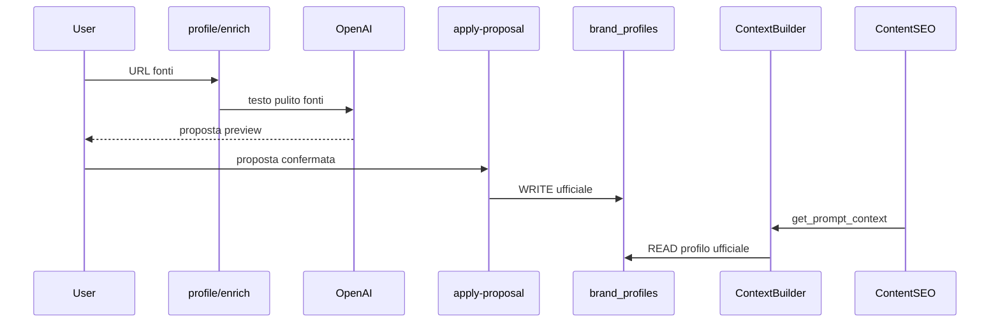

# Architettura AI

## Regola obbligatoria: Brand Intelligence Context

Ogni modulo AI che genera contenuti rivolti al brand **deve** caricare il contesto brand prima di produrre output.

```python
from app.services.brand_intelligence.context import BrandIntelligenceContextBuilder

bundle = await BrandIntelligenceContextBuilder.build_brand_context(session, project_id)
prompt_block = BrandIntelligenceContextBuilder.format_for_prompt(bundle)
# bundle.primary_source == "brand_profile" se profilo ufficiale sufficiente
```

**Priorità context (0.3.6 machine-ready):**

1. `brand_profiles` ufficiale → `primarySource=brand_profile` se profilo minimo presente
2. Profilo incompleto → `primarySource=minimal`, `missingContext` unificato
3. Bundle include `brandContextVersion: v1` e `promptContext` con blocchi testuali separati
4. Moduli ufficiali: Profile, Identity, Visual, Safe Claims, Product Knowledge, **FAQ & Objections**
5. Product SEO: contesto brand + lookup `productKnowledge` per `shopify_product_id`; fallback generale se item assente
6. **FAQ & Objections** (se compilata): dubbi, obiezioni e risposte consigliate in `fullText` — usata da PED, blog, social response, SEO ed email in modo non distruttivo
7. **Safe Claims ha priorità** su contenuti generati da FAQ: non usare FAQ per claim non consentiti
8. **AI Context Preview** (tab UI): mostra `promptContext.previewText`

**Regola fonte unica:** tutti i moduli AI brand-facing devono usare `BrandIntelligenceContextBuilder` e non leggere direttamente le tabelle Brand Intelligence.

Content SEO e Product SEO usano `get_prompt_context()` → `fullText` (non `previewText`). Se FAQ & Objections è vuota, il comportamento resta invariato.

### Blog Brief Generator (implementato — Content SEO Editorial 0.4.1-alpha)

Modulo attivo nella tab **Blog & Ricette** per generare brief SEO su singolo item editoriale.

- **Input**: item editoriale (tipo, keyword, obiettivo, prodotto collegato, note)
- **Context**: `BrandIntelligenceContextBuilder` — profilo, identity, Safe Claims, FAQ, Product Knowledge (+ PK specifico prodotto se collegato)
- **Safe Claims**: priorità assoluta nel prompt; claim vietati in `claimsToAvoid`
- **Output**: `brief_payload` JSONB; stato `brief_pending` dopo generate → `brief_approved` dopo approvazione utente
- **Prerequisito Article Generator**: solo item con `brief_approved` e brief valorizzato
- **Nessuna pubblicazione automatica** Shopify in questo step

### Blog Article Draft Generator (implementato — Content SEO Editorial 0.4.6-alpha)

Modulo attivo nella tab **Articolo & Anteprima** per generare bozze articolo da brief approvato.

- **Input**: `brief_payload` approvato + metadati item (tipo, prodotto collegato)
- **Context**: `BrandIntelligenceContextBuilder` — profilo, identity, Safe Claims, FAQ, Product Knowledge (+ PK specifico prodotto se collegato)
- **Safe Claims**: priorità assoluta nel prompt; nessun claim medico o terapeutico inventato
- **Output**: `article_payload` JSONB con `bodyHtml` sanitizzato; stato `draft_review` dopo generate
- **Anteprima**: HTML renderizzato lato client (whitelist tag via DOMParser) dopo sanitizzazione backend
- **Review umana**: salva bozza, modifica manuale, `ready_to_publish` prima di Shopify Publisher (step futuro)
- **OPENAI_API_KEY** richiesta; BI incompleta → warnings, non blocco

### Product SEO e Product Knowledge

Per ogni prodotto Shopify in ottimizzazione SEO:

1. Carica contesto brand (`profile` + `identity` + `safeClaims` + knowledge generale)
2. Se esiste `BrandProductKnowledgeItem` per quel `shopify_product_id` → include blocco specifico
3. Se item assente → usa solo knowledge generale + dati Shopify
4. Se Product Knowledge vuota → comportamento invariato (solo brand context + Shopify)

### promptContext (v0.3.6)

`GET /brand-intelligence/context` restituisce sempre `promptContext` quando il profilo è sufficiente.

```json
{
  "brandContextVersion": "v1",
  "faqObjections": { "generalFaq": [], "objections": [] },
  "promptContext": {
    "brandProfile": "BRAND PROFILE\n- Nome: ...",
    "brandIdentity": "BRAND IDENTITY\n- Posizionamento: ...",
    "visualIdentity": "VISUAL IDENTITY\n- Colori: ...",
    "safeClaims": "SAFE CLAIMS & RED FLAGS\n- ...",
    "productKnowledge": "PRODUCT KNOWLEDGE — GENERAL\n- ...",
    "faqObjections": "FAQ & OBJECTIONS\nFAQ generali:\n- ...",
    "fullText": "...",
    "previewText": "..."
  }
}
```

- **`fullText`**: contesto compatto per moduli AI (sezioni vuote omesse)
- **`previewText`**: anteprima human-friendly per tab AI Context
- **`faqObjections`**: blocco testuale con FAQ, obiezioni, miti e risposte consigliate (omesso se vuoto)

**Regola:** i moduli AI non devono usare campi UI raw nei prompt — solo `BrandContextBuilder` / `get_prompt_context()`.

Esempi di blocchi richiesti per modulo (futuro):

| Modulo | Blocchi consigliati |
|--------|---------------------|
| Product SEO | profile + identity + product knowledge + safe claims |
| PED | profile + identity + visual + social guidelines + pillars |
| Ads | profile + identity + safe claims + ads guidelines |
| Email | profile + identity + product knowledge + audience |

## Popolamento Brand Intelligence (v0.3.3)

| Percorso | Salvataggio |
|----------|-------------|
| **Brand Profile enrich** | Proposta in memoria; metadata fonti su profilo |
| **Apply proposal (profile)** | Campi contenuto ufficiali su `brand_profiles` |
| **Identity import-file** | Proposta AI da 1 file in memoria (no save) |
| **Apply proposal (identity)** | Scrittura ufficiale su `brand_identities` |
| **PUT identity** | Scrittura manuale su `brand_identities` |
| **Visual extract** | Proposta palette/logo/font in memoria |
| **Apply proposal (visual)** | Scrittura ufficiale su `brand_visual_identities` |
| **Safe Claims import-file** | Proposta AI da 1 file in memoria (no save) |
| **Apply proposal (safe claims)** | Scrittura ufficiale su `brand_safe_claims` |
| **Product Knowledge general import** | Proposta AI generale da 1 file (no save, no item) |
| **Apply proposal (PK general)** | Scrittura su `brand_product_knowledge_general` |
| **Items from-shopify** | Crea scheda precompilata su `brand_product_knowledge_items` |
| **PUT item** | Salvataggio manuale scheda prodotto |
| **Salvataggio manuale** | Via `PUT` su ciascun modulo |

### Flussi deprecati (non in UI)

- Brand Intelligence Brief, Import AI, section drafts, extracted facts
- Tabelle legacy restano in DB; non alimentano il ContextBuilder v1



### Source enrichment

File: `source_fetcher.py`, `profile_enrichment.py`

- Fetch parallelo leggero (website, social OG, recensioni)
- 403/429 → status `blocked`, warning, nessun fallimento globale
- Prompt italiano: non inventare, no claim medici, no SEO/ads in questo step
- Nessun auto-save sui campi contenuto
