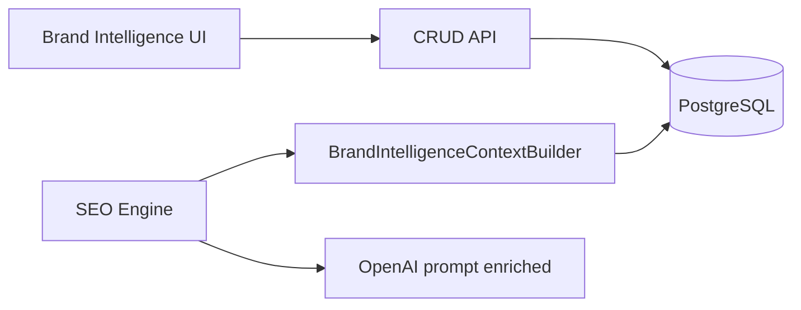

# Architettura AI

## Regola obbligatoria: Brand Intelligence Context

Ogni modulo AI che genera contenuti rivolti al brand **deve** caricare il contesto brand prima di produrre output.

```python
from app.services.brand_intelligence.context import BrandIntelligenceContextBuilder

bundle = await BrandIntelligenceContextBuilder.build_brand_context(session, project_id)
prompt_block = BrandIntelligenceContextBuilder.format_for_prompt(bundle)
```

Se `prompt_block` è `None`, il modulo decide se bloccare (futuro) o procedere con fallback (SEO v1).

## Moduli e integrazione

### SEO Proposal Engine (implementato)

File: `apps/api/app/services/content/seo_proposal_engine.py`, `seo_proposal_field_engine.py`

- Prima della chiamata OpenAI: `get_prompt_context(session, project_id)`
- Se presente, append `# Brand Intelligence` al system prompt
- **Nessuna nuova chiamata OpenAI** — solo arricchimento prompt esistente
- Fallback se profilo assente o score &lt; 10

### PED / Product Editorial (futuro)

Obbligatorio: voice, products, claims, guardrails. Blocco generazione se score &lt; 60.

### Ads Copy Generator (futuro)

Obbligatorio: profile, audience, claims. Validazione claim `forbidden` post-generazione.

### Email / Klaviyo (futuro)

Obbligatorio: voice, audience, content pillars. Tone check su output.

## Flusso dati



## Score come gate

| Score | Comportamento SEO v1 | Comportamento moduli futuri |
|-------|---------------------|----------------------------|
| 0–9 | Fallback (no brand block) | Blocco o warning |
| 10–59 | Brand block in prompt | Warning + lacune esplicite |
| 60+ | Brand block completo | Generazione consentita |
| 80+ | Ottimale | Generazione premium |

## Estensioni pianificate

- Sources: upload PDF/Word, estrazione AI con approvazione umana
- Site scan e social per arricchimento automatico
- Validazione output AI contro `BrandClaimRule` e `BrandAiGuardrail`
