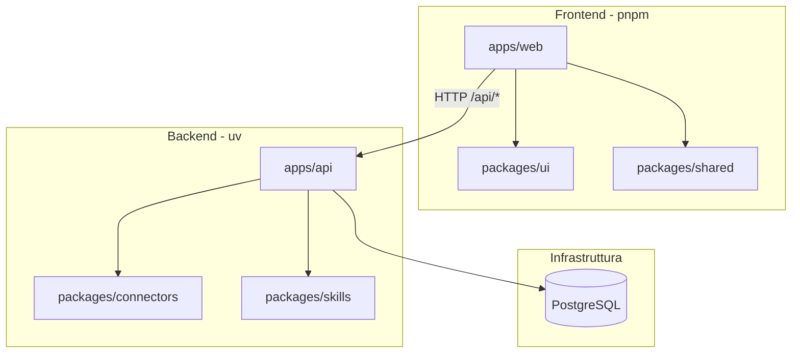
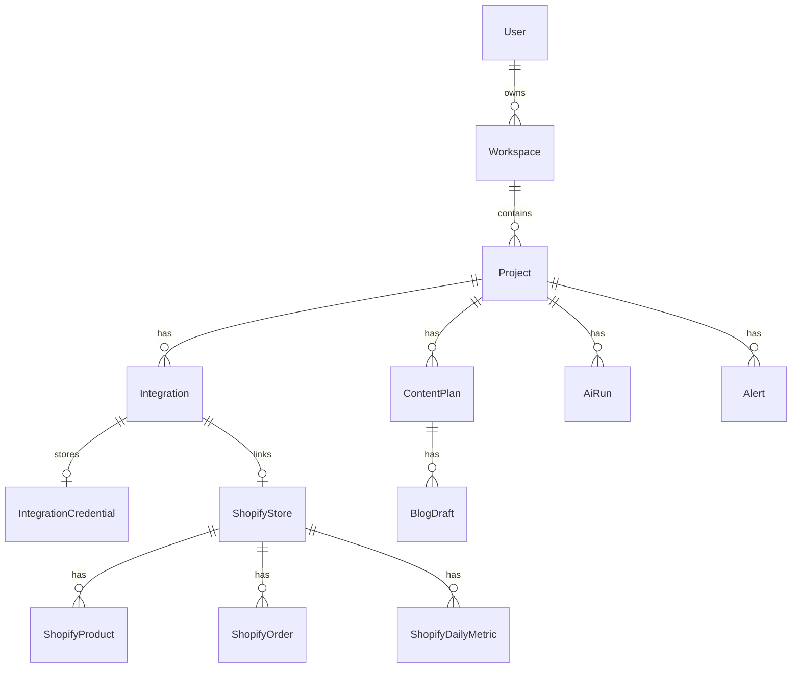

# Architettura

Growth Control Room è un monorepo ibrido che combina un frontend React e un backend Python FastAPI, con package condivisi per tipi, UI, connettori e skill AI.

## Panoramica



## Struttura monorepo

| Path | Stack | Responsabilità |
|------|-------|----------------|
| `apps/web` | React, Vite, TypeScript | Interfaccia utente, routing, pagine |
| `apps/api` | FastAPI, Python 3.12+ | REST API, orchestrazione integrazioni |
| `packages/shared` | TypeScript | Tipi e costanti condivisi (frontend) |
| `packages/ui` | React | Componenti UI riutilizzabili |
| `packages/connectors` | Python | Connettori per piattaforme esterne |
| `packages/skills` | Python | Skill AI (brief, analisi, automazioni) |

## Toolchain

- **JavaScript**: pnpm workspaces, Node 20+
- **Python**: uv workspace, Python 3.12+
- **Database**: PostgreSQL 16 (Docker Compose)
- **Dev server**: Vite (5173), Uvicorn (8000)

## Flusso dati (futuro)

1. L'utente crea un **progetto** (brand) dalla UI
2. Collega **integrazioni** via OAuth (Shopify, Meta, Google, ecc.)
3. L'API salva i token cifrati in PostgreSQL
4. Job di **sync** invocano i connector in `packages/connectors`
5. I dati aggregati alimentano dashboard e **skill AI** in `packages/skills`

## Convenzioni naming

### TypeScript

- Package scope: `@gcr/shared`, `@gcr/ui`, `@gcr/web`
- Tipi integrazione allineati ai connector Python (`IntegrationType`)

### Python

- Package: `gcr-connectors`, `gcr-skills`, `gcr-api`
- Moduli connector: `connectors.providers.<platform>`
- Registry pattern per lookup dinamico

## API

Tutte le route API sono prefissate con `/api`:

| Metodo | Path | Descrizione |
|--------|------|-------------|
| `GET` | `/api/health` | Health check con stato connectors/skills |
| `POST` | `/api/projects` | Crea progetto nel workspace default |
| `GET` | `/api/projects` | Lista progetti |
| `GET` | `/api/projects/{id}` | Dettaglio progetto |
| `GET` | `/api/projects/{id}/integrations` | Integrazioni del progetto |

Il proxy Vite in sviluppo inoltra `/api` verso `localhost:8000`.

## Database

PostgreSQL 16 via Docker Compose. ORM SQLAlchemy 2 async in `apps/api/app/models/`, migration Alembic in `apps/api/alembic/`.



### Workspace default (pre-auth)

Fino all'implementazione dell'autenticazione, la migration `001` crea:

- User: `dev@gcr.local`
- Workspace: slug `default`

Tutti gli endpoint progetti operano su questo workspace.

Comandi:

```bash
pnpm db:up        # avvia PostgreSQL
pnpm db:migrate   # applica migration
```

## Prossimi passi

1. Autenticazione JWT o session-based
2. OAuth flow per integrazioni (Shopify per primo)
3. Sync Shopify → tabelle product/order/metric
4. Wire frontend `ProjectsPage` all'API
5. Skill AI Brief collegata alla pagina `/projects/:id/ai-brief`
