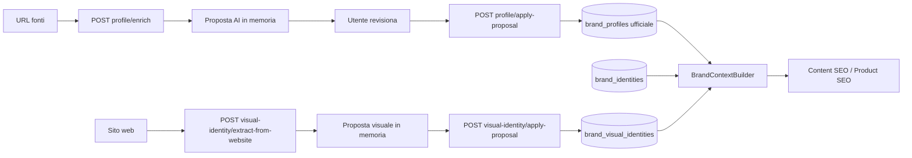

# Brand Intelligence

Brand Intelligence è la knowledge base del brand in Growth Control Room. **v0.3.1** estende il flusso modulare v0.3.0 con **Brand Identity** e **Visual Identity**.

## Strategia v0.3.1 — moduli Profile + Identity + Visual

La UI espone quattro tab:

1. **Overview** — tre card di stato (Profile, Identity, Visual Identity)
2. **Brand Profile** — fonti URL, proposta AI, profilo ufficiale
3. **Brand Identity** — posizionamento, valori, principi (salvataggio manuale)
4. **Visual Identity** — logo, palette, font, stile visuale + estrazione da sito

### Flusso operativo

1. L'utente compila **Brand Profile** (enrich + apply-proposal come in v0.3.0)
2. Compila **Brand Identity** manualmente (nessun enrich AI in questo step)
3. Compila **Visual Identity** manualmente oppure **Recupera da sito** → revisiona → **Applica proposta**
4. I moduli AI leggono Profile + Identity + Visual dal contesto ufficiale

### Endpoint attivi (v0.3.1)

| Metodo | Path | Ruolo |
|--------|------|-------|
| GET | `/brand-intelligence` | Overview con 3 moduli |
| GET | `/brand-intelligence/context` | Bundle Profile + Identity + Visual |
| GET/PUT | `/brand-intelligence/profile` | Brand Profile |
| POST | `/brand-intelligence/profile/enrich` | Fetch fonti + proposta AI (non salva contenuto) |
| POST | `/brand-intelligence/profile/apply-proposal` | Applica proposta profilo |
| GET/PUT | `/brand-intelligence/identity` | Brand Identity |
| GET/PUT | `/brand-intelligence/visual-identity` | Visual Identity |
| POST | `/brand-intelligence/visual-identity/extract-from-website` | Estrazione visuale (preview) |
| POST | `/brand-intelligence/visual-identity/apply-proposal` | Applica proposta visuale |

### Modelli DB

**`brand_profiles`** (migration 021) — invariato rispetto a v0.3.0.

**`brand_identities`** (migration 022, 1:1 `project_id`):

`positioning`, `brand_values`, `differentiators`, `production_principles`, `quality_principles`, `trust_elements`, `what_brand_is`, `what_brand_is_not`, `storytelling_notes`.

**`brand_visual_identities`** (migration 022, 1:1 `project_id`):

Logo/favicon URL, 5 colori base, `color_palette`, `fonts`, note stile, `do_show`/`do_not_show`, `website_extracted_palette` (snapshot ultima estrazione).

### Source fetcher e visual extraction

- **Profile enrich**: fetch leggero fonti pubbliche + proposta AI
- **Visual extract**: parse HTML per `og:image`, favicon, immagini header, colori da CSS inline, font da `font-family`
- Nessuno scraping aggressivo, nessun bypass anti-bot
- Sito irrecuperabile → warning leggibile, proposal vuota o parziale

### Regola fondamentale

**Nessun salvataggio automatico dati AI o estrazione.** Le proposte (profile enrich, visual extract) sono preview; solo `PUT` o `apply-proposal` scrivono i dati ufficiali.

`BrandContextBuilder` include **Brand Profile** (obbligatorio minimo), **Brand Identity** e **Visual Identity** (opzionali se compilati). `primarySource=brand_profile` se il profilo ha minimo; altrimenti `minimal`.

---

## Endpoint deprecati (non usati da UI v1)

Restano nel backend per compatibilità DB/migration, marcati `deprecated` in OpenAPI:

- Import AI (batch, upload, start, status, refresh-context)
- Extracted facts, section drafts, brief mode
- CRUD sezioni avanzate (voice, products, audience, claims, SEO, pillars, guardrails, assets, documenti)

Le tabelle e migration 015–020 **non sono state rimosse**.

### Test manuali

1. Aprire Brand Intelligence → 4 tab visibili
2. Compilare e salvare Brand Identity → persistenza
3. Visual Identity manuale + Recupera da sito → proposta → Applica
4. Overview mostra 3 card aggiornate
5. `GET .../brand-intelligence/context` include `brandIdentity` e `visualIdentity`
6. Content SEO continua a funzionare con contesto brand
7. Fonte bloccata (es. Instagram 429): warning visibile, enrich non fallisce
8. Sito irrecuperabile: errore leggibile, nessun profilo inventato
