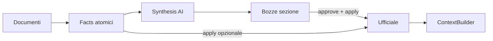

# Brand Intelligence

Brand Intelligence è la knowledge base strutturata del brand in Growth Control Room. Ogni progetto ha un profilo brand che alimenta i moduli AI (SEO, futuri PED/Ads/Email) con contesto coerente, compliance e voice.

## Onboarding

All'apertura di un progetto nuovo o con score basso, l'Overview propone due percorsi:

1. **Compilazione guidata** — wizard manuale con sole informazioni obbligatorie minime
2. **Importa da file con AI** — upload PDF/DOCX/TXT/MD, estrazione testo, classificazione OpenAI, review umana

Le sezioni avanzate restano compilabili nelle tab dedicate per migliorare lo score.

## AI File Import v1 (0.2.1) e Import Jobs v1 (0.2.2)

### Flusso batch (0.2.2)

1. **Upload** — `POST .../sources/upload` crea un `BrandImportBatch` e collega i documenti (`batchId` in response)
2. **Start job** — `POST .../import-batches/{batchId}/start` avvia elaborazione asincrona
3. **Polling** — `GET .../import-batches/{batchId}/status` ogni ~2s; progress su DB (`progress_percent`, `current_step`)
4. **Conflict detection** — confronto read-only con tabelle ufficiali; `update_mode`, `previous_value`, `conflict_status`
5. **Review** — approva/modifica/rifiuta facts (inclusi conflitti evidenziati)
6. **Apply** — `POST .../extracted-facts/apply` con `{ factIds, batchId? }` — solo `approved`, rispetta `update_mode`

### Flusso legacy sincrono (deprecato)

1. **Upload** — `POST .../sources/upload` (multipart, max 10 file, 15MB ciascuno)
2. **Estrazione testo** — sincrona al upload (pypdf, python-docx); storage alpha: `text_only`
3. **Estrazione AI** — `POST .../sources/{id}/extract` o `extract-batch` (bloccante); crea `BrandExtractedFact` con `status=suggested`
4. **Review umana** — approva, modifica, sposta sezione o rifiuta ogni fact
5. **Apply** — `POST .../extracted-facts/apply` salva **solo** facts `approved` nelle tabelle ufficiali

### Regola fondamentale

Le estrazioni AI sono **suggestions**, non dati ufficiali. `BrandIntelligenceContextBuilder` legge solo le tabelle CRUD ufficiali — facts non approvati e bozze sezione non applicate non entrano nel contesto AI.

## Tre livelli di dati (0.2.3)

| Livello | Tabella | Ruolo |
|---------|---------|-------|
| **Evidenze** | `brand_extracted_facts` | Campi atomici estratti dai documenti; review granulare opzionale |
| **Bozze sezione** | `brand_section_drafts` | Sintesi AI aggregata per sezione; review umana strutturata |
| **Ufficiale** | Tabelle CRUD BI | Solo dati approvati e applicati; alimentano score e ContextBuilder |

## AI Section Synthesis v1 (0.2.3)

Dopo conflict detection nel batch job, `synthesis.py` genera fino a 9 bozze (`brand_section_drafts`):

1. Raggruppa facts per `section_key` (es. `product_knowledge` + `category_knowledge` → `products_categories`)
2. Carica excerpt documenti e snapshot ufficiale read-only (per diff UI)
3. OpenAI structured output → `draft_payload`, `summary`, `confidence`, `warnings`
4. Upsert draft per `(project_id, section_key, batch_id)` in stati attivi

### Review bozze (step 3 Import AI)

- Griglia 9 card sezione: stato, confidence, summary, fonti, warnings
- Editor strutturato per sezione; approve/reject prima dell'apply
- Link secondario **Review dettagliata** → facts atomici (`BrandExtractedFactsReview`)

### Apply bozze (non distruttivo)

- Solo draft `status=approved`
- Sezioni scalari (profile, voice, seo): enrich campi ufficiali **vuoti**; conflitto se campo già valorizzato e diverso → draft `needs_review`, apply bloccato
- Liste (prodotti, audience, claims, …): match per nome/titolo, create se nuovo, enrich se esiste con campi vuoti
- Dopo apply: `status=applied`, `applied_at` impostato; score riflette solo dati ufficiali

Senza `OPENAI_API_KEY`: batch completa facts, synthesis fallisce con warning su batch; endpoint `POST .../synthesize` risponde 503.

## Salvataggio fonti e rigenerazione bozze (0.2.5)

Flusso esplicito per aggiornare le fonti brand su un batch esistente e rigenerare le bozze senza rieseguire l'estrazione AI dai file.

### Flusso UI

1. **Salva fonti brand** — `PUT .../import-batches/{batchId}/sources` (upsert completo, nessuna AI)
2. **Aggiorna fonti e rigenera Brand Intelligence** — salva fonti → `POST .../refresh-context` (async)
3. Polling su `GET .../status` durante `ai_processing` → auto step 3 su `review_ready`

Se non esiste ancora un batch, l'UI crea prima un batch vuoto con `POST .../import-batches`.

### Upsert fonti (`PUT /sources`)

| Comportamento | Dettaglio |
|---------------|-----------|
| Batch | Aggiorna `declaredBrandName`, `declaredWebsiteUrl` |
| Match | Per `(source_type, normalized_url)` → update; altrimenti insert `status=pending` |
| URL rimossi | `status=skipped`, `fetch_error="Rimossa dall'utente"` (storico conservato) |
| URL cambiato | Reset `status=pending`, clear campi `fetched_*` per re-fetch |

### Refresh context async (`POST /refresh-context`)

| Progress | Step |
|----------|------|
| 5% | Salvataggio fonti brand |
| 20% | Recupero sito web |
| 35% | Recupero fonti social e recensioni |
| 55% | Integrazione fonti esterne con i documenti |
| 75% | Rigenerazione bozze Brand Intelligence |
| 100% | Bozze pronte per revisione |

Operazioni:

1. `status=ai_processing`
2. Re-fetch fonti (`refetch_failed=True`)
3. Bozze non applicate (`draft`, `needs_review`, `approved`) → `rejected` — **`applied` non toccato**
4. `synthesize_batch` crea nuove bozze
5. `status=review_ready`

Non riesegue estrazione facts dai file. Non modifica BI ufficiale né bozze già applicate.

### Lista bozze ultima versione

`GET /section-drafts?latestOnly=true` (default): una bozza attiva per `section_key`, esclude `rejected` e `applied`.

## Source Enrichment v1 (0.2.4)

Durante l'import AI l'utente può indicare **fonti brand esterne** oltre ai file:

| Campo | Note |
|-------|------|
| Brand name | Opzionale ma consigliato |
| Website URL | Fetch HTML pubblico (title, meta, testo principale) |
| Social | Instagram, Facebook, TikTok, YouTube, LinkedIn — metadati pubblici se accessibili |
| Recensioni | Trustpilot, Google Business — tentativo singolo GET |
| Altre fonti | Lista dinamica URL + label |

### Limiti v1

- Una sola richiesta HTTP per fonte; timeout breve; nessun login
- Nessuno scraping aggressivo o crawl multi-pagina
- Social spesso bloccati → status `skipped`, solo URL dichiarata come fonte
- Fonte non accessibile → warning batch, batch continua, nessuna invenzione AI
- Dati estratti restano in **facts/bozze** fino ad approve+apply — zero write su BI ufficiale

### Progress batch (con fonti esterne)

| Fase | Progress |
|------|----------|
| Upload / estrazione testo | 5–35% |
| Recupero fonti esterne | 35–50% |
| AI facts extraction | 50–75% |
| Conflict detection | ~73% |
| Section synthesis | 75–95% |
| Review ready | 100% |

Tabella: `brand_external_sources` (migration 019). Bozze tracciano `source_external_ids`.

## Sezioni

| Sezione | Obbligatoria (score minimo) | Descrizione |
|---------|----------------------------|-------------|
| Brand Profile | Sì | Nome, descrizione, settore, storia |
| Voice & Tone | Sì | Tono, stile, parole da usare/evitare |
| Products & Categories | Sì | Almeno 1 prodotto/categoria con nome + descrizione |
| Audience | Consigliata | Segmenti di pubblico |
| Claims & Compliance | Sì | Almeno 1 claim `forbidden` o `caution` |
| SEO Strategy | Consigliata | Keyword primarie |
| Content Pillars | Consigliata | Pilastri editoriali |
| AI Guardrails | Sì | Almeno 1 regola `must_not` |
| Assets | Opzionale | Logo, colori, font (bonus score) |

## Brand Knowledge Score

Punteggio 0–100 calcolato come media pesata delle 9 sezioni:

- **incomplete** (&lt; 60): profilo insufficiente per AI on-brand
- **developing** (60–79): utilizzabile con lacune
- **ready** (≥ 80): profilo maturo per generazione contenuti

Riflette solo dati ufficiali (post-apply). L'endpoint `GET /api/projects/{id}/brand-intelligence/score` restituisce score, sezioni, campi mancanti e raccomandazioni.

## Uso AI

`BrandIntelligenceContextBuilder.build_brand_context(project_id)` è la **fonte unica** del contesto brand per tutti i moduli AI.

- **SEO Optimizer (v1)**: integrazione opzionale — se il profilo è vuoto o score &lt; 10, il prompt SEO resta invariato (fallback).
- **Moduli futuri** (PED, Ads, Email): il contesto brand sarà **obbligatorio** prima della generazione.

## API

Base path: `/api/projects/{project_id}/brand-intelligence`

**CRUD ufficiale:** overview, score, context, profile, voice, products, audience, claims, seo-strategy, pillars, guardrails, assets

**Import AI (batch jobs v0.2.2):**

- `POST /sources/upload` — multipart `files[]`, opzionale `batchName`, `notes` → `{ batchId, status, documents }`
- `POST /import-batches/{batchId}/start` — avvia job async
- `GET /import-batches/{batchId}/status` — polling progress + documenti
- `GET /import-batches` — storico batch
- `GET /sources` — lista documenti
- `POST /sources/{document_id}/extract` — estrazione AI singola (legacy)
- `POST /sources/extract-batch` — deprecato, preferire start + poll
- `GET /extracted-facts` — query: `status`, `targetSection`, `sourceDocumentId`, `batchId`
- `PATCH /extracted-facts/{fact_id}` — review
- `POST /extracted-facts/apply` — `{ factIds, batchId? }` solo approved

**Section drafts (synthesis v0.2.3):**

- `POST /import-batches/{batchId}/synthesize` — rigenera tutte le bozze del batch
- `GET /section-drafts` — query: `batchId`, `status`, `sectionKey`, `latestOnly` (default `true`, v0.2.5)
- `GET /section-drafts/{draft_id}` — dettaglio con payload e snapshot ufficiale
- `PATCH /section-drafts/{draft_id}` — modifica payload, status, warnings
- `POST /section-drafts/{draft_id}/apply` — apply singolo draft approvato
- `POST /section-drafts/apply-batch` — `{ draftIds }`
- `POST /section-drafts/{draft_id}/regenerate` — body opzionale `instructions`, `includeFactIds`

Overview include `pendingSectionDraftsCount` e `latestBatchId`.

**External sources (enrichment v0.2.4):**

- `POST /import-batches` — crea batch + fonti (JSON: `brandName`, `websiteUrl`, `sources[]`)
- `POST /sources/upload` — esteso: `brandName`, `websiteUrl`, `sources` (JSON), `batchId` opzionale
- `GET /import-batches/{batchId}/external-sources` — fonti analizzate
- `POST /import-batches/{batchId}/external-sources` — aggiunge fonti a batch esistente
- `POST /import-batches/{batchId}/fetch-sources` — re-fetch manuale
- `PUT /import-batches/{batchId}/sources` — upsert fonti brand (v0.2.5)
- `POST /import-batches/{batchId}/refresh-context` — fetch + archivia bozze + rigenera async (v0.2.5)

## UI

Sidebar progetto → **Brand Intelligence** (dopo Control Room).

- **Overview**: onboarding dual-path, score ring, sezioni
- **Wizard**: minimo obbligatorio
- **Import AI**: upload → elaborazione async con progress bar → **bozze per sezione** (step 3); pulsanti **Salva fonti** / **Aggiorna e rigenera**; hydration form da batch salvato; review facts opzionale; storico batch
- **Documenti**: elenco file caricati + link allo storico import
- **Tab per sezione**: CRUD manuale

Route import: `/projects/:id/brand-intelligence/import`

## Migration

- `015_brand_intelligence_foundation` — 10 tabelle CRUD
- `016_brand_intelligence_ai_import` — `brand_source_documents`, `brand_extracted_facts`
- `017_brand_import_batches` — `brand_import_batches`, campi batch/progress/conflict su documents e facts
- `018_brand_section_drafts` — `brand_section_drafts`, bozze AI per sezione con snapshot ufficiale
- `019_brand_external_sources` — `brand_external_sources`, enrichment URL sito/social/recensioni
