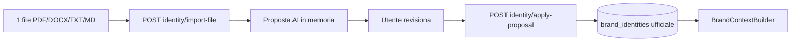

# Brand Intelligence

Brand Intelligence è la knowledge base del brand in Growth Control Room. **v0.3.6** aggiunge la sezione modulare **FAQ & Objections**.

## Strategia v0.3.6 — FAQ & Objections

La UI espone otto tab:

1. **Overview** — card stato moduli (inclusa FAQ & Objections)
2. **Brand Profile** — fonti, enrich, profilo ufficiale + Avvisi fonti esterne
3. **Brand Identity**
4. **Visual Identity**
5. **Safe Claims & Red Flags**
6. **Product Knowledge**
7. **FAQ & Objections** — import file scoped, proposta modificabile, dati ufficiali
8. **AI Context** — anteprima `promptContext`

### Cosa raccoglie FAQ & Objections

| Campo | Contenuto |
|-------|-----------|
| FAQ generali | Domande frequenti sul brand |
| Domande prodotto/processo | Ingredienti, produzione, uso |
| Domande acquisto/spedizione | Ordini, pagamenti, resi |
| Obiezioni | Dubbi ricorrenti dei clienti |
| Falsi miti | Fraintendimenti da correggere |
| Risposte consigliate | Solo se presenti o deducibili dal file |
| Opportunità contenuto | Spunti PED/blog/social/email |
| Insight social | Dubbi da commenti social |

**Differenza concettuale:** le FAQ rispondono a domande; le obiezioni esprimono resistenze; i falsi miti sono credenze errate; le opportunità contenuto sono spunti editoriali derivati.

### Import singolo file (scoped)

1. Carica **un solo file** (PDF, DOCX, TXT, MD)
2. L'AI estrae **solo** FAQ/obiezioni — non Identity, Safe Claims, Product Knowledge, PED o blog
3. Restituisce proposta modificabile (`proposal`, `confidence`, `warnings`) — **nessun auto-save**
4. L'utente applica con **Applica proposta** → `POST .../faq-objections/apply-proposal`
5. Merge non distruttivo: campi assenti nella proposta non cancellano dati esistenti

### Endpoint

- `GET/PUT /brand-intelligence/faq-objections`
- `POST /brand-intelligence/faq-objections/import-file`
- `POST /brand-intelligence/faq-objections/apply-proposal`

Tabella: `brand_faq_objections` (1:1 project). Migration `025`.

## Strategia v0.3.5 — AI Context Preview

La sezione AI Context Preview (tab 8) mostra `promptContext.previewText` e include il blocco FAQ & Objections quando compilato.

`GET /brand-intelligence/context` restituisce `promptContext.fullText` (moduli AI) e `faqObjections` nel bundle.

## Strategia v0.3.4 — Product Knowledge

La UI espone le sezioni modulari sopra (Overview + 5 moduli + AI Context).

### Due livelli

| Livello | Tabella | Uso |
|---------|---------|-----|
| **Generale** | `brand_product_knowledge_general` | Principi validi per tutti i prodotti |
| **Specifico** | `brand_product_knowledge_items` | Scheda per prodotto Shopify (FK `shopify_products`) |

### Import file (solo generale)

1. Carica **un solo file** (catalogo, scheda tecnica, linee guida)
2. L'AI estrae **solo** regole generali; dettagli di singoli prodotti (es. "Miele di Limone") → principi comuni, **non** schede specifiche
3. Applica proposta → `brand_product_knowledge_general`
4. Nessun auto-save

### Import file schede prodotto specifiche

1. Nella sezione **Schede prodotto specifiche**, carica un file (catalogo master, schede tecniche)
2. L'AI estrae **solo** schede prodotto identificate nel file — una per prodotto
3. Compila **solo** i campi presenti o chiaramente deducibili; i restanti restano vuoti
4. Match automatico con prodotti Shopify sincronizzati (titolo/handle); override manuale in UI
5. Proposta modificabile per ogni scheda → **Salva scheda** o **Salva tutte le schede valide**
6. Duplicati (stesso nome o stesso `shopify_product_id`): **non sovrascritti** — warning + salvataggio manuale
7. Nessun auto-save; nessun field-level AI in questo step

| Metodo | Path |
|--------|------|
| POST | `/brand-intelligence/product-knowledge/items/import-file` |
| POST | `/brand-intelligence/product-knowledge/items/apply-import-proposal` |

### Schede prodotto da Shopify

1. CTA "Aggiungi prodotto da Shopify" → lista prodotti sincronizzati
2. `POST .../items/from-shopify` crea scheda precompilata (nome, handle, GID, product line)
3. Compilazione manuale accordion; salvataggio per item

**Completion modulo:** generale presente **e** ≥1 item = completo; generale **oppure** ≥1 item = parziale.

**Legacy:** `brand_product_knowledge` + route `.../products` restano deprecati.

### Endpoint Product Knowledge (v0.3.4)

| Metodo | Path |
|--------|------|
| GET/PUT | `/brand-intelligence/product-knowledge/general` |
| POST | `/brand-intelligence/product-knowledge/general/import-file` |
| POST | `/brand-intelligence/product-knowledge/general/apply-proposal` |
| GET | `/brand-intelligence/product-knowledge/shopify-products` |
| GET/POST | `/brand-intelligence/product-knowledge/items` |
| POST | `/brand-intelligence/product-knowledge/items/import-file` |
| POST | `/brand-intelligence/product-knowledge/items/apply-import-proposal` |
| POST | `/brand-intelligence/product-knowledge/items/from-shopify` |
| GET/PUT/DELETE | `/brand-intelligence/product-knowledge/items/{item_id}` |

### Context machine-ready

`GET /context` espone `productKnowledge.generalRules` + `productKnowledge.specificProducts[]`.
`promptContext.productKnowledge` include blocchi `PRODUCT KNOWLEDGE — GENERAL` e `SPECIFIC PRODUCTS`.
Product SEO: lookup per `shopify_product_id` + fallback solo generale se item assente.

---

## Strategia v0.3.3 — Safe Claims & Red Flags

La UI (v0.3.3) ha introdotto Safe Claims come quarto modulo.

### Flusso Safe Claims da file

1. L'utente carica **un solo file** (policy, legal, brand guidelines)
2. L'AI estrae **solo** Safe Claims (allowed/forbidden/caution, disclaimer, red flags)
3. L'utente modifica la proposta in UI
4. **Applica proposta** → scrittura ufficiale su `brand_safe_claims`
5. Il form manuale si aggiorna e resta editabile

**Completion:** almeno 1 claim consentito + 1 vietato + (1 cautela **oppure** 1 disclaimer).

**Legacy:** `brand_claim_rules` / CRUD `.../claims` resta deprecato e non usato dal nuovo flusso.

### Endpoint Safe Claims (v0.3.3)

| Metodo | Path | Ruolo |
|--------|------|-------|
| GET/PUT | `/brand-intelligence/safe-claims` | Safe Claims manuale |
| POST | `/brand-intelligence/safe-claims/import-file` | Estrazione testo + proposta AI (preview) |
| POST | `/brand-intelligence/safe-claims/apply-proposal` | Applica proposta dopo conferma |

### Ruolo nei moduli AI

- `BrandContextBuilder` include blocco `SAFE CLAIMS & RED FLAGS` in `promptContext.fullText`
- Se Safe Claims vuota → fallback statico di prudenza + voce in `missingContext`
- Product SEO e Content SEO usano `get_prompt_context()` senza modifiche alle chiamate esistenti

---

## Strategia v0.3.2 — Identity import + context machine-ready

La UI (v0.3.2) ha introdotto import Identity e `promptContext` machine-ready.

### Flusso Brand Identity da file

1. L'utente carica **un solo file** dedicato all'identità del brand
2. L'AI estrae **solo** campi Brand Identity (posizionamento, valori, principi, storytelling)
3. L'utente modifica la proposta in UI
4. **Applica proposta** → scrittura ufficiale su `brand_identities`
5. Il form manuale si aggiorna e resta editabile

**Non include:** batch import, extracted facts, section drafts, brief, Product Knowledge, FAQ, Claims, PED.

### Endpoint attivi (v0.3.2)

| Metodo | Path | Ruolo |
|--------|------|-------|
| GET/PUT | `/brand-intelligence/identity` | Brand Identity manuale |
| POST | `/brand-intelligence/identity/import-file` | Estrazione testo + proposta AI (preview) |
| POST | `/brand-intelligence/identity/apply-proposal` | Applica proposta dopo conferma |
| GET/PUT | `/brand-intelligence/profile` | Brand Profile |
| GET/PUT | `/brand-intelligence/visual-identity` | Visual Identity |
| POST | `/brand-intelligence/visual-identity/extract-from-website` | Estrazione visuale |
| POST | `/brand-intelligence/visual-identity/apply-proposal` | Applica proposta visuale |
| GET | `/brand-intelligence/context` | Bundle machine-ready + `promptContext` |

### Context machine-ready vs UI human-friendly

- **UI**: form editabili, proposte AI, liste multilinea — pensati per revisione umana
- **Context API** (`GET /context`): JSON strutturato con `brandContextVersion: v1`, `brandProfile`, `brandIdentity`, `visualIdentity`, `missingContext`
- **promptContext**: testo pulito per moduli AI (`brandProfile`, `brandIdentity`, `visualIdentity`, `safeClaims`, `fullText`)

I moduli AI (Content SEO, Product SEO, futuri PED/Ads/Email) devono usare `BrandContextBuilder.get_prompt_context()` — non i campi UI raw.

### Regola fondamentale

**Nessun salvataggio automatico dati AI.** Import-file e enrich generano solo preview; solo `PUT` o `apply-proposal` scrivono i dati ufficiali.

---

## Endpoint deprecati (non usati da UI v1)

Restano nel backend per compatibilità DB/migration, marcati `deprecated` in OpenAPI:

- Import AI batch, extracted facts, section drafts, brief mode
- CRUD sezioni avanzate legacy

### Test manuali

1. Brand Identity → carica PDF → Genera proposta → Applica → refresh → dati persistiti
2. `GET .../context` → `brandIdentity` + `promptContext.fullText` pulito
3. File non supportato / vuoto → errore leggibile
4. OPENAI_API_KEY assente → errore 503 leggibile
