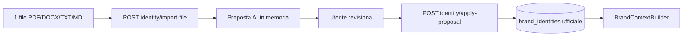

# Brand Intelligence

Brand Intelligence è la knowledge base del brand in Growth Control Room. **v0.3.3** aggiunge Safe Claims & Red Flags come quarto modulo ufficiale, con import scoped e guardrail per i moduli AI.

## Strategia v0.3.3 — Safe Claims & Red Flags

La UI espone cinque tab:

1. **Overview** — cinque card di stato (Profile, Identity, Visual Identity, Safe Claims)
2. **Brand Profile** — fonti URL, proposta AI, profilo ufficiale
3. **Brand Identity** — form manuale + import da 1 file con proposta AI
4. **Visual Identity** — logo, palette, font + estrazione da sito
5. **Safe Claims & Red Flags** — claim consentiti/vietati, disclaimer, regole salute/competitor, process secrets

### Flusso Safe Claims da file

1. L'utente carica **un solo file** (policy, legal, brand guidelines)
2. L'AI estrae **solo** Safe Claims (allowed/forbidden/caution, disclaimer, red flags)
3. L'utente modifica la proposta in UI
4. **Applica proposta** → scrittura ufficiale su `brand_safe_claims`
5. Il form manuale si aggiorna e resta editabile

**Completion:** almeno 1 claim consentito + 1 vietato + (1 cautela **oppure** 1 disclaimer).

**Legacy:** `brand_claim_rules` / CRUD `.../claims` resta deprecato e non usato dal nuovo flusso.

### Endpoint Safe Claims (v0.3.3)

| Metodo | Path | Ruolo |
|--------|------|-------|
| GET/PUT | `/brand-intelligence/safe-claims` | Safe Claims manuale |
| POST | `/brand-intelligence/safe-claims/import-file` | Estrazione testo + proposta AI (preview) |
| POST | `/brand-intelligence/safe-claims/apply-proposal` | Applica proposta dopo conferma |

### Ruolo nei moduli AI

- `BrandContextBuilder` include blocco `SAFE CLAIMS & RED FLAGS` in `promptContext.fullText`
- Se Safe Claims vuota → fallback statico di prudenza + voce in `missingContext`
- Product SEO e Content SEO usano `get_prompt_context()` senza modifiche alle chiamate esistenti

---

## Strategia v0.3.2 — Identity import + context machine-ready

La UI (v0.3.2) ha introdotto import Identity e `promptContext` machine-ready.

### Flusso Brand Identity da file

1. L'utente carica **un solo file** dedicato all'identità del brand
2. L'AI estrae **solo** campi Brand Identity (posizionamento, valori, principi, storytelling)
3. L'utente modifica la proposta in UI
4. **Applica proposta** → scrittura ufficiale su `brand_identities`
5. Il form manuale si aggiorna e resta editabile

**Non include:** batch import, extracted facts, section drafts, brief, Product Knowledge, FAQ, Claims, PED.

### Endpoint attivi (v0.3.2)

| Metodo | Path | Ruolo |
|--------|------|-------|
| GET/PUT | `/brand-intelligence/identity` | Brand Identity manuale |
| POST | `/brand-intelligence/identity/import-file` | Estrazione testo + proposta AI (preview) |
| POST | `/brand-intelligence/identity/apply-proposal` | Applica proposta dopo conferma |
| GET/PUT | `/brand-intelligence/profile` | Brand Profile |
| GET/PUT | `/brand-intelligence/visual-identity` | Visual Identity |
| POST | `/brand-intelligence/visual-identity/extract-from-website` | Estrazione visuale |
| POST | `/brand-intelligence/visual-identity/apply-proposal` | Applica proposta visuale |
| GET | `/brand-intelligence/context` | Bundle machine-ready + `promptContext` |

### Context machine-ready vs UI human-friendly

- **UI**: form editabili, proposte AI, liste multilinea — pensati per revisione umana
- **Context API** (`GET /context`): JSON strutturato con `brandContextVersion: v1`, `brandProfile`, `brandIdentity`, `visualIdentity`, `missingContext`
- **promptContext**: testo pulito per moduli AI (`brandProfile`, `brandIdentity`, `visualIdentity`, `safeClaims`, `fullText`)

I moduli AI (Content SEO, Product SEO, futuri PED/Ads/Email) devono usare `BrandContextBuilder.get_prompt_context()` — non i campi UI raw.

### Regola fondamentale

**Nessun salvataggio automatico dati AI.** Import-file e enrich generano solo preview; solo `PUT` o `apply-proposal` scrivono i dati ufficiali.

---

## Endpoint deprecati (non usati da UI v1)

Restano nel backend per compatibilità DB/migration, marcati `deprecated` in OpenAPI:

- Import AI batch, extracted facts, section drafts, brief mode
- CRUD sezioni avanzate legacy

### Test manuali

1. Brand Identity → carica PDF → Genera proposta → Applica → refresh → dati persistiti
2. `GET .../context` → `brandIdentity` + `promptContext.fullText` pulito
3. File non supportato / vuoto → errore leggibile
4. OPENAI_API_KEY assente → errore 503 leggibile
