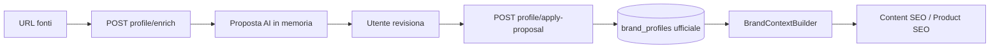

# Brand Intelligence

Brand Intelligence è la knowledge base del brand in Growth Control Room. **v0.3.0** riparte da un flusso semplice e stabile: **Brand Profile v1**.

## Strategia v0.3.0 — Brand Profile v1

La UI espone solo due tab:

1. **Overview** — stato del profilo, confidence enrich, CTA aggiornamento
2. **Brand Profile** — fonti URL, proposta AI, profilo ufficiale

### Flusso operativo

1. L'utente inserisce nome brand, sito, social e piattaforme recensioni
2. **Recupera informazioni** → fetch leggero fonti pubbliche + proposta AI (nessun salvataggio automatico sui campi contenuto)
3. L'utente modifica la proposta in UI
4. **Applica proposta** → scrittura su `brand_profiles` (profilo ufficiale)
5. I moduli AI leggono solo il profilo ufficiale applicato

### Endpoint attivi (v1)

| Metodo | Path | Ruolo |
|--------|------|-------|
| GET | `/brand-intelligence` | Overview semplificata |
| GET | `/brand-intelligence/context` | Bundle per debug/integrazioni |
| GET/PUT | `/brand-intelligence/profile` | Lettura / salvataggio manuale |
| POST | `/brand-intelligence/profile/enrich` | Fetch fonti + proposta AI (non salva contenuto) |
| POST | `/brand-intelligence/profile/apply-proposal` | Applica proposta dopo conferma utente |

### Modello `brand_profiles` (migration 021)

Campi fonte: `brand_name`, `website_url`, social URL, `other_sources`, `source_status`, `last_enriched_at`, `enrichment_confidence`, `enrichment_warnings`.

Campi contenuto ufficiale: `short_description`, `story`, `mission`, `values`, `differentiators`, `origin_notes`, `production_notes`, `tone_notes`, `customer_notes`, `ai_summary`.

Campi legacy conservati: `industry`, `country` (non usati nel flusso v1 UI).

### Source fetcher

- Website: title, meta, heading, paragrafi puliti (script/style/tracking rimossi)
- Social: solo metadati OG pubblici
- Trustpilot / Google Business: se bloccati (403/429) → warning, enrich continua
- Nessuno scraping aggressivo, nessun bypass anti-bot

### Regola fondamentale

**Nessun salvataggio automatico dati AI.** La proposta enrich è preview; solo `apply-proposal` scrive i campi contenuto ufficiali.

`BrandContextBuilder` usa **solo** il Brand Profile ufficiale (`primarySource=brand_profile`). Se incompleto → `primarySource=minimal`.

---

## Endpoint deprecati (non usati da UI v1)

Restano nel backend per compatibilità DB/migration, marcati `deprecated` in OpenAPI:

- Import AI (batch, upload, start, status, refresh-context)
- Extracted facts, section drafts, brief mode
- CRUD sezioni avanzate (voice, products, audience, claims, SEO, pillars, guardrails, assets, documenti)

Le tabelle e migration 015–020 **non sono state rimosse**.

### Test manuali

1. Aprire Brand Intelligence → solo Overview e Brand Profile
2. Inserire brand + sito → Recupera informazioni
3. Modificare proposta → Applica proposta
4. Overview mostra profilo attivo con dati
5. `GET .../brand-intelligence/context` → `primarySource: brand_profile`
6. Content SEO continua a funzionare con contesto brand
7. Fonte bloccata (es. Instagram 429): warning visibile, enrich non fallisce
8. Sito irrecuperabile: errore leggibile, nessun profilo inventato
