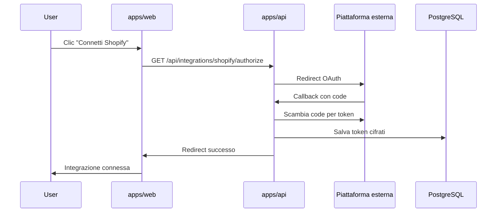

# Integrazioni

Growth Control Room supporta il collegamento di piattaforme e-commerce e marketing a livello di progetto. Ogni integrazione è gestita da un **connector** in `packages/connectors`.

## Integrazioni pianificate

| Tipo | Label | Provider |
|------|-------|----------|
| `shopify` | Shopify | `ShopifyConnector` |
| `meta_ads` | Meta Ads | `MetaAdsConnector` |
| `google_ads` | Google Ads | `GoogleAdsConnector` |
| `klaviyo` | Klaviyo | `KlaviyoConnector` |
| `gsc` | Google Search Console | `GscConnector` |
| `ga4` | Google Analytics 4 | `Ga4Connector` |
| `merchant_center` | Merchant Center | `MerchantCenterConnector` |
| `tiktok` | TikTok Ads | `TikTokConnector` |

I tipi TypeScript in `@gcr/shared` e l'enum Python `IntegrationType` sono allineati.

## Contratto BaseConnector

Ogni connector implementa:

```python
class BaseConnector(ABC):
    integration_type: IntegrationType

    async def validate_credentials(self, credentials: dict) -> bool: ...
    async def sync(self, project_id: str) -> SyncResult: ...
```

- **validate_credentials**: verifica token/chiavi API prima del salvataggio
- **sync**: scarica e normalizza i dati per un progetto

## Registry

Il registry in `connectors/registry.py` mappa `IntegrationType → ConnectorClass`:

```python
connector = get_connector(IntegrationType.SHOPIFY)
result = await connector.sync(project_id="abc123")
```

L'API userà il registry per istanziare il connector corretto in base al tipo di integrazione collegata al progetto.

## Stato attuale

L'integrazione **Shopify OAuth** è operativa in `apps/api` (connessione store, sync, dashboard).

Il package `packages/connectors` contiene ancora uno stub `ShopifyConnector`; la logica reale vive in `apps/api/app/services/shopify/`.

### Shopify Sync v2

Il sync Shopify v2 (`POST /api/projects/{id}/shopify/sync`) esegue:

- **Paginazione cursor-based** (100 record/pagina) su prodotti e ordini
- **Tutti i prodotti** disponibili nello shop
- **Ordini** disponibili con lo scope attuale (`read_orders`): di default **ultimi 60 giorni** (senza `read_all_orders`)
- **Normalizzazione DB** di varianti prodotto (`shopify_product_variants`) e line items ordine (`shopify_order_line_items`)
- **Attribution first/last touch** su colonne ordine (UTM, landing page, source, channel)
- **Metriche giornaliere** ricostruite localmente dagli ordini sincronizzati

Limiti attuali:

| Funzionalità | Stato |
|--------------|-------|
| ShopifyQL / report Analytics aggregati | Implementato via `read_reports` + ShopifyQL (fallback locale se non autorizzato) |
| `read_customers` (LTV, numberOfOrders) | Non richiesto nello scope attuale |
| `read_all_orders` (storico > 60 gg) | Non richiesto; serve approvazione Partner |
| GA4 / Meta / Google Ads / Klaviyo | Non implementato |

Scope OAuth attuali: `read_products`, `read_orders`, `read_content`, `write_content`, `read_reports`.

**ShopifyQL:** richiede lo scope `read_reports`. Dopo l'aggiornamento degli scope, **riconnettere Shopify** (OAuth) per emettere un token con i nuovi permessi. I token esistenti non ereditano `read_reports`.

Endpoint principali:

- `GET /api/projects/{id}/integrations/shopify/oauth/start?shop=...`
- `GET /api/integrations/shopify/oauth/callback`
- `POST /api/projects/{id}/shopify/sync`
- `GET /api/projects/{id}/shopify/dashboard`
- `GET /api/projects/{id}/shopify/reconciliation`
- `GET /api/projects/{id}/shopify/shopifyql/probe`
- `GET /api/projects/{id}/shopify/analytics/official`

Query params opzionali per filtro periodo:

| Parametro | Descrizione |
|-----------|-------------|
| `range` | Preset temporale (default: `last_30_days`) |
| `start_date` | Data inizio ISO (`YYYY-MM-DD`), obbligatoria con `range=custom` |
| `end_date` | Data fine ISO (`YYYY-MM-DD`), obbligatoria con `range=custom` |

Valori `range` supportati: `today`, `yesterday`, `last_7_days`, `last_30_days`, `month_to_date`, `previous_month`, `custom`.

Le date sono interpretate nel timezone IANA dello store Shopify (`shopify_stores.timezone`), con fallback `UTC`.

La response include `period`, `comparison`, `reconciliation`, `officialAnalytics`, `analyticsReconciliation` e `summary` (con `periodMetrics` / `currentStateMetrics`).

**Nota:** La Shopify Control Room supporta filtri temporali per metriche basate sugli ordini. Inventario e SEO rappresentano invece lo stato corrente dello store.

**Nota:** La Shopify Control Room supporta confronto con periodo precedente per metriche ordine, attribution e performance prodotto.

### Metriche revenue Shopify

| Metrica | Descrizione |
|---------|-------------|
| `currentTotalSum` | Somma dei totali ordine correnti (`currentTotalPriceSet`). Comportamento precedente di GCR, utile come diagnostica. |
| `totalSales` (Shopify-like) | Calcolo locale: `grossSales − discounts − salesReversals + taxes + shipping`. Fallback attivo se ShopifyQL non è disponibile. |
| `officialAnalytics.kpis.totalSales` | Total sales ufficiale da ShopifyQL (`read_reports`), allineato alla dashboard Analytics Shopify. |

Il blocco `reconciliation` espone breakdown locale (`metricMode: shopify_like_local`).

Il blocco `officialAnalytics` espone (quando `available: true`):

- `kpis`: `totalSales`, `orders`, `averageOrderValue`, `sessions`, `conversionRate`
- `timeseries`: vendite/ordini (e sessioni se disponibili) per giorno
- `salesByReferringChannel`, `salesByUtmCampaign`
- `dataQuality`: `ok` \| `limited` \| `unavailable`

Il blocco `analyticsReconciliation` confronta `officialTotalSales` vs `localTotalSales` con delta e messaggio esplicativo.

**ShopifyQL non fornisce ROAS/ad spend** (Meta, Google Ads, Klaviyo restano non implementati). Il fallback locale resta sempre attivo: sync, product intelligence, inventory, orders e SEO non dipendono da ShopifyQL.

Probe ShopifyQL:

```bash
curl -H "Authorization: Bearer <token>" \
  "https://<api-host>/api/projects/<project_id>/shopify/shopifyql/probe"
```

Risposta attesa con permessi OK: `{ "available": true, "requiresReconnect": false, "sample": { ... } }`

Senza `read_reports`: `{ "available": false, "requiresReconnect": true, "errorCode": "missing_read_reports" }`

L'endpoint debug `GET /api/projects/{id}/shopify/reconciliation` accetta gli stessi query params del dashboard e restituisce breakdown esteso, refund nel periodo e un campione di ordini (senza email o token).

**Importante:** dopo l'aggiornamento sync refund/tax, eseguire un nuovo `POST .../shopify/sync` per popolare importi refund e tax nel database locale.

Esempi frontend (persistiti in URL):

- `/projects/:id/shopify?range=last_7_days`
- `/projects/:id/shopify?range=custom&start_date=2026-06-01&end_date=2026-06-10`

Gli altri connector (Meta, GA4, ecc.) restano **stub**.

### Content SEO Engine Foundation

Modulo dedicato alla **Content SEO Room** (`/projects/:id/content`), separato da Shopify Sync v2.

**Cosa sincronizza** (`POST /api/projects/{id}/content/seo/sync-shopify`):

- Collections Shopify (description, SEO, image, products count)
- Pages (body, SEO, publishedAt)
- Blogs
- Articles (body, SEO, tags, author) — paginazione per blog via Admin GraphQL

**Cosa analizza** (`POST /api/projects/{id}/content/seo/analyze`):

- Audit SEO su prodotti (da DB Sync v2), collections, pages, articles
- Issue persistite in `seo_audit_issues` (status `open`, rigenerate ad ogni analyze)
- Opportunità editoriali in `content_opportunities` (status `new`, rigenerate ad ogni analyze)
- Best seller, prodotti fermi con stock, internal linking, FAQ, miglioramenti collection/prodotto

**Dashboard** (`GET /api/projects/{id}/content/seo/dashboard`):

- Summary KPI, issue, opportunità, slice prodotto/collection/internal linking

**Cosa non fa ancora**:

- Generazione automatica articoli o brief AI
- Pubblicazione su Shopify (nessun uso di `write_content` in questo step)
- GA4, Search Console, Meta Ads, Google Ads, Klaviyo

**Publishing**: non automatico. Lo scope `write_content` sarà usato solo in step successivo per draft/publish controllato con conferma manuale.

**Skill interna**: `packages/skills/seo/shopify-content/` (regole audit, opportunità, internal linking, brief, publishing).

**Migration**: `009_content_seo_foundation` — tabelle contenuti Shopify + `seo_audit_issues`, `content_opportunities`, `content_briefs`.

### Product & Collection SEO Optimizer

Modulo **Product & Collection SEO Optimizer** su `/projects/:id/content` — separato da blog/editorial (tab Blog & Ricette = coming soon).

**Score rule-based trasparente** (0–100, breakdown pesato per componente in `scoreBreakdown`):

- Prodotti: title, seoTitle, metaDescription, description, handle, tags, imageAlt
- Collections: title, seoTitle, metaDescription, description, handle, imageAlt
- Formula: ogni componente ha score 0–100; punti = `round(score × peso / 100)`; totale = somma punti (pesi sommano a 100)
- Skill runtime: `packages/skills/seo/gcr-shopify-seo/`, caricata da `seo_skill_loader.py` (fallback + log)
- UI drawer tab Score: sezione **Skill SEO applicata** + `skillMeta` in risposta dettaglio

**Sync** (`POST /api/projects/{id}/content/seo/sync-shopify`):

- Prodotti via Shopify Sync v2 (descriptionHtml, media alt)
- **Collections** (categorie Shopify, non tag prodotto) via content sync GraphQL
- Query collections: `updatedAt`, `seo`, `image`, `productsCount { count }` (API 2026-04); fallback senza `productsCount` se lo shop restituisce errore sul campo Count
- Response arricchita: `collectionsSynced`, `warnings`, `message` — sync collections **non silenzioso** (errori visibili in UI anche con HTTP 200)
- Debug supporto: `GET .../content/seo/debug` — count prodotti/collections/analisi, `lastContentSync`, ultimi errori sync collections

**Analisi**:

- `POST .../content/seo/products/analyze`
- `POST .../content/seo/collections/analyze` — se nessuna collection in DB, `message` esplicito: eseguire prima sync Shopify

**Liste e dettaglio**:

- `GET .../content/seo/products` — score, severity, issues, vendite/stock, hasProposal
- `GET .../content/seo/collections`
- `GET .../content/seo/products/{product_id}` — prodotto, analysis, scoreBreakdown, currentValues, images, latestProposal, storico
- `GET .../content/seo/collections/{collection_id}` — analogo

**Flusso Modifica → Proposta → Approvazione** (nessuna modifica live senza conferma):

1. UI: bottone **Modifica** in tabella apre **SEO Edit Workspace** (portal, opaco, quasi full-screen) con tab Campi SEO, Score, Proposta, Storico
2. Campi precompilati da `currentValues` (camelCase da Shopify sync): title, handle, seoTitle, metaDescription, descriptionHtml, images (con altText), productType, vendor — con fallback `descriptionHtml` da `raw_payload` se assente in DB
3. Badge per campo: **OK** / **Mancante** / **Da migliorare** (da analisi + valore; si aggiornano lato client quando il form viene riempito)
4. **Proposta manuale**: footer **Salva come proposta** → `POST .../proposals/manual` — salva i valori attuali del form; non tocca Shopify
5. **Genera proposta AI** (footer): `POST .../proposals/generate` — compila **direttamente** i campi del tab Campi SEO (seo title, meta, descrizione, alt immagini); salva draft; non approva né applica su Shopify; messaggio *"Proposta AI inserita nel form. Controlla e salva prima di applicare."*
6. Tab **Proposta** secondaria: preview current vs proposed, reasoning, risk (non serve per compilare il form)
7. **Approve**: footer **Approva** — non applica su Shopify
8. **Apply**: footer **Applica su Shopify** — solo se `approved` + scope `write_products` + conferma utente; microcopy scope solo vicino al bottone Apply
9. Dopo apply riuscito, GCR aggiorna **DB locale** e ricalcola **analisi singola** — UI aggiornata senza sync completo
10. **Sync singola entità** (fallback): `POST .../products/{id}/sync-shopify` / `POST .../collections/{id}/sync-shopify`
11. **Sync completo** solo per riallineamenti massivi
12. **Score prodotto** senza componente Tag; pesi su title, handle, seo title, meta, descrizione, image alt
13. **Collections sync**: `productsCount { count }` (GraphQL 2026-04) — nessun fallimento sync per campo Count

**Detail response** (`skillMeta`):

- `skillMeta` costruito via `SeoSkillMetaRead` (validazione snake_case interna, serializzazione camelCase in JSON)
- `scoreRuleCategories` con fallback `default_factory=list` — nessun 500 per campi skill mancanti
- Apply resta bloccato senza `write_products`

**Versioning**: progetto in Alpha `0.x.x-alpha`. Storico in [`CHANGELOG.md`](../CHANGELOG.md) e UI `/projects/:id/changelog`. Policy: [`docs/changelog-policy.md`](../docs/changelog-policy.md).

**Env API**:

- `OPENAI_API_KEY` (opzionale; se assente, modifica manuale OK, AI disabilitata in UI)
- `OPENAI_MODEL` (default `gpt-4o-mini`)

**Scope apply** (`write_products`):

- **Scope configurati** (`SHOPIFY_SCOPES` su Railway): permessi richiesti dall'app al merchant durante OAuth
- **Scope concessi** (token salvato): permessi realmente associati al token OAuth corrente
- Dopo aver aggiunto `write_products` in app Shopify **e** in `SHOPIFY_SCOPES`, serve **riconnettere Shopify** (token vecchio non eredita nuovi permessi)
- Verifica live: `GET /api/projects/{id}/shopify/scopes` — interroga Shopify (`currentAppInstallation.accessScopes` con fallback REST `access_scopes.json`) e aggiorna cache `shopify_stores.granted_scopes`
- UI **Shopify Control Room** (`/projects/:id/shopify`): card collassabile **Permessi Shopify** con configured/granted/missing scopes e CTA **Verifica permessi** / **Riconnetti Shopify** (non più in Content SEO)
- Apply (`POST .../proposals/{id}/apply`) verifica scope reali del token, non solo env statica; response arricchita con `updatedEntity`, `updatedAnalysis`, `localUpdateFailed`

**Migrations**: `010_product_collection_seo_optimizer`, `011_seo_score_breakdown`, `012_shopify_granted_scopes`

**Legacy**: `GET .../content/seo/dashboard` resta disponibile (fix empty-safe); UI usa endpoint optimizer.

### SEO Skill Pack

Growth Control Room usa un **SEO skill pack interno** ispirato e adattato da [AgriciDaniel/claude-seo](https://github.com/AgriciDaniel/claude-seo) (MIT License).

**Reference pack** (non runtime): `packages/skills/external/claude-seo/imported-skills/`

- `seo-ecommerce`, `seo-images`, `seo-content-brief`, `seo-schema`, `seo-cluster`
- Solo file markdown auditati; nessuno script, hook o estensione MCP

**Runtime pack** (caricato dal backend): `packages/skills/seo/gcr-shopify-seo/`

| File | Uso attuale |
|------|-------------|
| `product-seo-rules.md` | Scoring prodotti (allineato a `seo_scoring_engine.py`) |
| `collection-seo-rules.md` | Scoring collections |
| `image-alt-rules.md` | Alt text + proposte AI |
| `proposal-rules.md` | Proposte manuale/AI |
| `brand-guardrails.md` | Vincoli prompt AI |
| `content-brief-rules.md` | **Futuro** blog/ricette |
| `schema-rules.md` | **Futuro** JSON-LD Product/Breadcrumb |
| `source-map.md` | Tracciabilità origine regole |

**Cosa usiamo ora**: scoring prodotti/collections, alt text, proposte AI con guardrails.

**Cosa useremo dopo**: blog brief, schema markup live, keyword cluster (reference da `seo-cluster`).

**Differenza reference vs runtime**: il pack external è archivio MIT per audit e attribuzione; il pack `gcr-shopify-seo` è adattato ai campi Shopify syncati in GCR e alimenta loader, analyzer metadata e prompt AI.

Attribuzione completa: [`THIRD_PARTY_NOTICES.md`](../THIRD_PARTY_NOTICES.md).

Pack legacy deprecato: `packages/skills/seo/shopify-product-collection/` (vedi README in cartella).

## Flusso OAuth (design futuro)



### Componenti previsti

1. **Route OAuth** in `apps/api/app/api/routes/integrations/`
2. **Modello Credential** con token cifrati (Fernet o KMS)
3. **Webhook handlers** per aggiornamenti in tempo reale (Shopify, ecc.)
4. **Job scheduler** per sync periodici (APScheduler o Celery)

### Sicurezza

- Token mai esposti al frontend
- Refresh token con rotazione automatica
- Scope OAuth minimi per ogni piattaforma
- Revoca integrazione = cancellazione credential + revoca token lato provider

## Frontend

La pagina `/projects/:id/integrations` elenca tutte le integrazioni disponibili usando `INTEGRATIONS` da `@gcr/shared`.

Shopify ha una pagina dedicata `/projects/:id/shopify` per configurazione avanzata una volta implementato OAuth.

## Prossima implementazione consigliata

1. **Shopify** — OAuth Admin API, sync prodotti/ordini
2. **GA4** — OAuth Google, report traffico/conversioni
3. **Meta Ads** — OAuth Meta Business, metriche campagne
