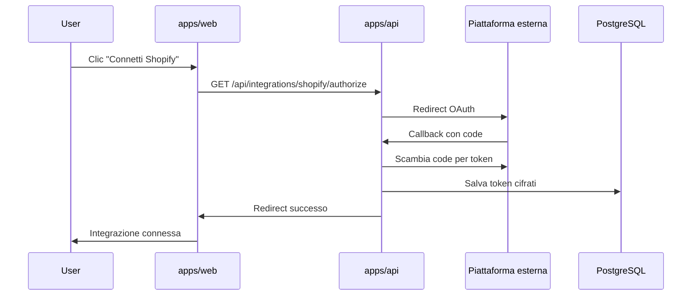

# Integrazioni

Growth Control Room supporta il collegamento di piattaforme e-commerce e marketing a livello di progetto. Ogni integrazione è gestita da un **connector** in `packages/connectors`.

## Integrazioni pianificate

| Tipo | Label | Provider |
|------|-------|----------|
| `shopify` | Shopify | `ShopifyConnector` |
| `meta_ads` | Meta Ads | `MetaAdsConnector` |
| `google_ads` | Google Ads | `GoogleAdsConnector` |
| `klaviyo` | Klaviyo | `KlaviyoConnector` |
| `gsc` | Google Search Console | `GscConnector` |
| `ga4` | Google Analytics 4 | `Ga4Connector` |
| `merchant_center` | Merchant Center | `MerchantCenterConnector` |
| `tiktok` | TikTok Ads | `TikTokConnector` |

I tipi TypeScript in `@gcr/shared` e l'enum Python `IntegrationType` sono allineati.

## Contratto BaseConnector

Ogni connector implementa:

```python
class BaseConnector(ABC):
    integration_type: IntegrationType

    async def validate_credentials(self, credentials: dict) -> bool: ...
    async def sync(self, project_id: str) -> SyncResult: ...
```

- **validate_credentials**: verifica token/chiavi API prima del salvataggio
- **sync**: scarica e normalizza i dati per un progetto

## Registry

Il registry in `connectors/registry.py` mappa `IntegrationType → ConnectorClass`:

```python
connector = get_connector(IntegrationType.SHOPIFY)
result = await connector.sync(project_id="abc123")
```

L'API userà il registry per istanziare il connector corretto in base al tipo di integrazione collegata al progetto.

## Stato attuale

Tutti i connector sono **stub**: i metodi sollevano `NotImplementedError`. Nessun OAuth o chiamata API reale è implementato.

## Flusso OAuth (design futuro)



### Componenti previsti

1. **Route OAuth** in `apps/api/app/api/routes/integrations/`
2. **Modello Credential** con token cifrati (Fernet o KMS)
3. **Webhook handlers** per aggiornamenti in tempo reale (Shopify, ecc.)
4. **Job scheduler** per sync periodici (APScheduler o Celery)

### Sicurezza

- Token mai esposti al frontend
- Refresh token con rotazione automatica
- Scope OAuth minimi per ogni piattaforma
- Revoca integrazione = cancellazione credential + revoca token lato provider

## Frontend

La pagina `/projects/:id/integrations` elenca tutte le integrazioni disponibili usando `INTEGRATIONS` da `@gcr/shared`.

Shopify ha una pagina dedicata `/projects/:id/shopify` per configurazione avanzata una volta implementato OAuth.

## Prossima implementazione consigliata

1. **Shopify** — OAuth Admin API, sync prodotti/ordini
2. **GA4** — OAuth Google, report traffico/conversioni
3. **Meta Ads** — OAuth Meta Business, metriche campagne
