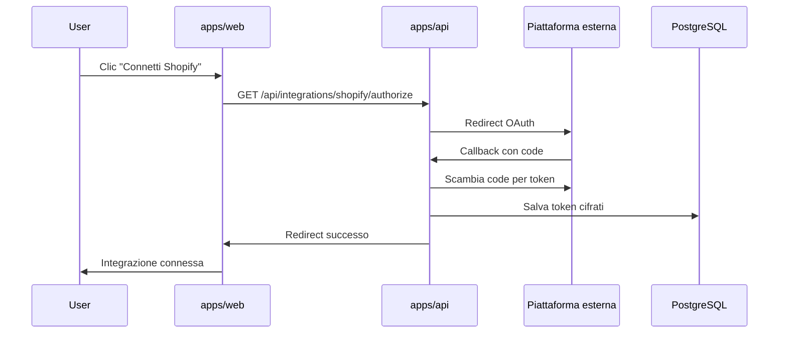

# Integrazioni

Growth Control Room supporta il collegamento di piattaforme e-commerce e marketing a livello di progetto. Ogni integrazione è gestita da un **connector** in `packages/connectors`.

## Integrazioni pianificate

| Tipo | Label | Provider |
|------|-------|----------|
| `shopify` | Shopify | `ShopifyConnector` |
| `meta_ads` | Meta Ads | `MetaAdsConnector` |
| `google_ads` | Google Ads | `GoogleAdsConnector` |
| `klaviyo` | Klaviyo | `KlaviyoConnector` |
| `gsc` | Google Search Console | `GscConnector` |
| `ga4` | Google Analytics 4 | `Ga4Connector` |
| `merchant_center` | Merchant Center | `MerchantCenterConnector` |
| `tiktok` | TikTok Ads | `TikTokConnector` |

I tipi TypeScript in `@gcr/shared` e l'enum Python `IntegrationType` sono allineati.

## Contratto BaseConnector

Ogni connector implementa:

```python
class BaseConnector(ABC):
    integration_type: IntegrationType

    async def validate_credentials(self, credentials: dict) -> bool: ...
    async def sync(self, project_id: str) -> SyncResult: ...
```

- **validate_credentials**: verifica token/chiavi API prima del salvataggio
- **sync**: scarica e normalizza i dati per un progetto

## Registry

Il registry in `connectors/registry.py` mappa `IntegrationType → ConnectorClass`:

```python
connector = get_connector(IntegrationType.SHOPIFY)
result = await connector.sync(project_id="abc123")
```

L'API userà il registry per istanziare il connector corretto in base al tipo di integrazione collegata al progetto.

## Stato attuale

L'integrazione **Shopify OAuth** è operativa in `apps/api` (connessione store, sync, dashboard).

Il package `packages/connectors` contiene ancora uno stub `ShopifyConnector`; la logica reale vive in `apps/api/app/services/shopify/`.

### Shopify Sync v2

Il sync Shopify v2 (`POST /api/projects/{id}/shopify/sync`) esegue:

- **Paginazione cursor-based** (100 record/pagina) su prodotti e ordini
- **Tutti i prodotti** disponibili nello shop
- **Ordini** disponibili con lo scope attuale (`read_orders`): di default **ultimi 60 giorni** (senza `read_all_orders`)
- **Normalizzazione DB** di varianti prodotto (`shopify_product_variants`) e line items ordine (`shopify_order_line_items`)
- **Attribution first/last touch** su colonne ordine (UTM, landing page, source, channel)
- **Metriche giornaliere** ricostruite localmente dagli ordini sincronizzati

Limiti attuali:

| Funzionalità | Stato |
|--------------|-------|
| ShopifyQL / report Analytics aggregati | Non implementato |
| `read_customers` (LTV, numberOfOrders) | Non richiesto nello scope attuale |
| `read_all_orders` (storico > 60 gg) | Non richiesto; serve approvazione Partner |
| GA4 / Meta / Google Ads / Klaviyo | Non implementato |

Scope OAuth attuali: `read_products`, `read_orders`, `read_content`, `write_content`.

Endpoint principali:

- `GET /api/projects/{id}/integrations/shopify/oauth/start?shop=...`
- `GET /api/integrations/shopify/oauth/callback`
- `POST /api/projects/{id}/shopify/sync`
- `GET /api/projects/{id}/shopify/dashboard`
- `GET /api/projects/{id}/shopify/reconciliation`

Query params opzionali per filtro periodo:

| Parametro | Descrizione |
|-----------|-------------|
| `range` | Preset temporale (default: `last_30_days`) |
| `start_date` | Data inizio ISO (`YYYY-MM-DD`), obbligatoria con `range=custom` |
| `end_date` | Data fine ISO (`YYYY-MM-DD`), obbligatoria con `range=custom` |

Valori `range` supportati: `today`, `yesterday`, `last_7_days`, `last_30_days`, `month_to_date`, `previous_month`, `custom`.

Le date sono interpretate nel timezone IANA dello store Shopify (`shopify_stores.timezone`), con fallback `UTC`.

La response include `period` (`range`, `startDate`, `endDate`, `timezone`, `label`), nel `summary` i gruppi `periodMetrics` / `currentStateMetrics`, il blocco `comparison` con confronto vs periodo precedente equivalente (`currentPeriod`, `previousPeriod`, `metrics`, `attribution`, `products`, `dataQuality`), e il blocco `reconciliation` con breakdown metriche Shopify-like.

**Nota:** La Shopify Control Room supporta filtri temporali per metriche basate sugli ordini. Inventario e SEO rappresentano invece lo stato corrente dello store.

**Nota:** La Shopify Control Room supporta confronto con periodo precedente per metriche ordine, attribution e performance prodotto.

### Metriche revenue Shopify

| Metrica | Descrizione |
|---------|-------------|
| `currentTotalSum` | Somma dei totali ordine correnti (`currentTotalPriceSet`). Comportamento precedente di GCR, utile come diagnostica. |
| `totalSales` (Shopify-like) | `grossSales − discounts − salesReversals + taxes + shipping`. I reversal sono attribuiti al giorno in cui il refund viene processato, anche se l'ordine originale è fuori periodo. |
| ShopifyQL (futuro) | Parità esatta con la dashboard Analytics Shopify via `read_reports` / ShopifyQL. |

Il blocco `reconciliation` espone:

- `metricMode`: `shopify_like_local`
- `orders`: conteggi `total`, `paid`, `pending`, `cancelled`, `unpaid` (ordini piazzati nel periodo per `createdAt`)
- `salesBreakdown`: componenti della formula sopra + `currentTotalSum`
- `dataQuality`: `ok` \| `limited` \| `warning` con messaggi esplicativi (tax/duties assenti, reversal fuori storico sync, ecc.)

L'endpoint debug `GET /api/projects/{id}/shopify/reconciliation` accetta gli stessi query params del dashboard e restituisce breakdown esteso, refund nel periodo e un campione di ordini (senza email o token).

**Importante:** dopo l'aggiornamento sync refund/tax, eseguire un nuovo `POST .../shopify/sync` per popolare importi refund e tax nel database locale.

Esempi frontend (persistiti in URL):

- `/projects/:id/shopify?range=last_7_days`
- `/projects/:id/shopify?range=custom&start_date=2026-06-01&end_date=2026-06-10`

Gli altri connector (Meta, GA4, ecc.) restano **stub**.

## Flusso OAuth (design futuro)



### Componenti previsti

1. **Route OAuth** in `apps/api/app/api/routes/integrations/`
2. **Modello Credential** con token cifrati (Fernet o KMS)
3. **Webhook handlers** per aggiornamenti in tempo reale (Shopify, ecc.)
4. **Job scheduler** per sync periodici (APScheduler o Celery)

### Sicurezza

- Token mai esposti al frontend
- Refresh token con rotazione automatica
- Scope OAuth minimi per ogni piattaforma
- Revoca integrazione = cancellazione credential + revoca token lato provider

## Frontend

La pagina `/projects/:id/integrations` elenca tutte le integrazioni disponibili usando `INTEGRATIONS` da `@gcr/shared`.

Shopify ha una pagina dedicata `/projects/:id/shopify` per configurazione avanzata una volta implementato OAuth.

## Prossima implementazione consigliata

1. **Shopify** — OAuth Admin API, sync prodotti/ordini
2. **GA4** — OAuth Google, report traffico/conversioni
3. **Meta Ads** — OAuth Meta Business, metriche campagne
